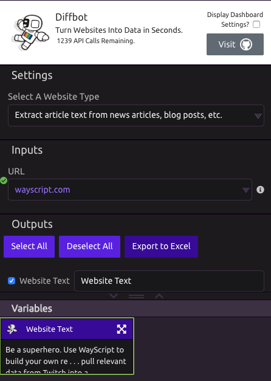

# Diffbot


Learn more about Diffbot on their [website](https://www.diffbot.com)


## Extract Article Text

### Inputs

* **URL** - the website link you want to pull text from. \(E.g. wayscript.com\)

### Outputs

* **Website Text** - The websites text.
* **JSON Data** - The raw JSON results from Diffbot. 

## Data from any shopping or e-commerce product page

### Inputs

* **URL** - the e-commerce ****website link you want to pull text from.

### Outputs

* **Product Name**
* **Product Brand**
* **Product Price**
* **SKU Number**
* **Description**
* **Image URL**
* **Product Availability**

## Forum/Discussion/Product conversations and reviews

This mode, pulls [lists](../../introduction/variables.md#lists) of all of the posts on the forum page. 

### Inputs

* **URL** - the forum link you want to pull text from.

### Outputs

* **Post Title**
* **Post Author**
* **Post Text**
* **Post Author URL**
* **Post Date**
* **Post Language**

