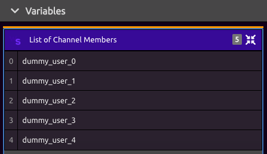
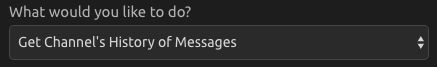
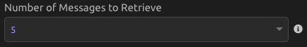
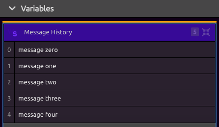

# Discord

## **Setup**

### **Select a Discord Guild/Server**

Select the Discord Guild/Server you would like to work with.

### **Choose a Channel**

Choose a Discord channel to work with.


If you have recently added a channel and do not see it, click the refresh button.


## **Modes**

### **Write to a Channel**

Enter the message you want to send.

### **Get a List of Channel Members**

Retrieve a list of the display names of all the members in the channel.

### Get a List of Messages from the Channel's History

Retrieve a list of the desired number of messages from the channel history.

Input the number of messages you want retrieved. If you do not enter a number, it will default to 5 messages.

