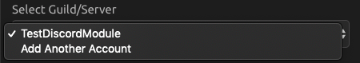
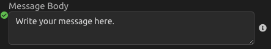

# Discord



To run your script when Discord events occur, use the [Discord Trigger](../triggers/discord-trigger.md).


## \*\*\*\*⚙ **Setup**

### \*\*\*\*🔎 **Select a Discord Guild/Server**

Select the Discord Guild/Server you would like to work with.



### \*\*\*\*\#⃣ **Choose a Channel**

Choose a Discord channel to work with.


If you have recently added a channel and do not see it, click the refresh button.



## \*\*\*\*🤖 **Modes**

### \*\*\*\*✏ **Write to a Channel**

Enter the message you want to send. You can also specify a name that the bot should use and an image URL for the bot to use as its icon.




### 💬 Get a List of Messages from the Channel's History

Retrieve a list of the desired number of messages from the channel history.

Input the number of messages you want retrieved. If you do not enter a number, it will default to 5 messages.

#### 📤 Output

```graphql
Message_History = [
    {
        content : String, 
        author : {
            username : String, 
            avatar : String, 
            discriminator : String, 
            id : String,
        },
        attachments : [
            {
                filename : String, 
                height : Int, 
                id : String, 
                proxy_url : Url, 
                size : Int, 
                url : Url, 
                width : Int, 
            },
        ],
        channel_id : String, 
        edited_timestamp : Date, 
        embeds : [
            {
                author : String, 
                title : String, 
                type : String, 
                description : String, 
                url : Url, 
                timestamp : Date,
            },
        ],
        id : String, 
        mention_everyone : Bool, 
        mention_roles : [
            String, 
        ],
        mentions : [
            {
                username : String, 
                avatar : String,
                discriminator : String, 
                id : String,
            },
        ],
        pinned : Bool, 
        timestamp : Date, 
        tts : Bool, 
        type : Int, 
    },
]
```

