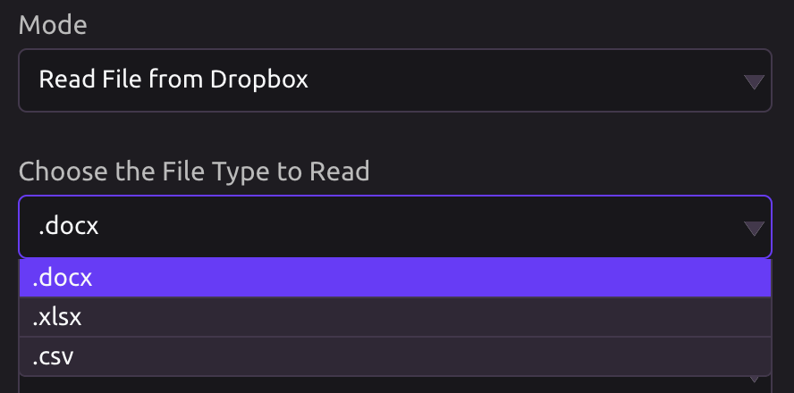
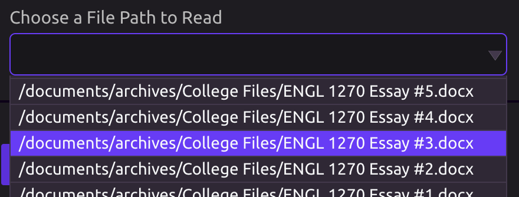
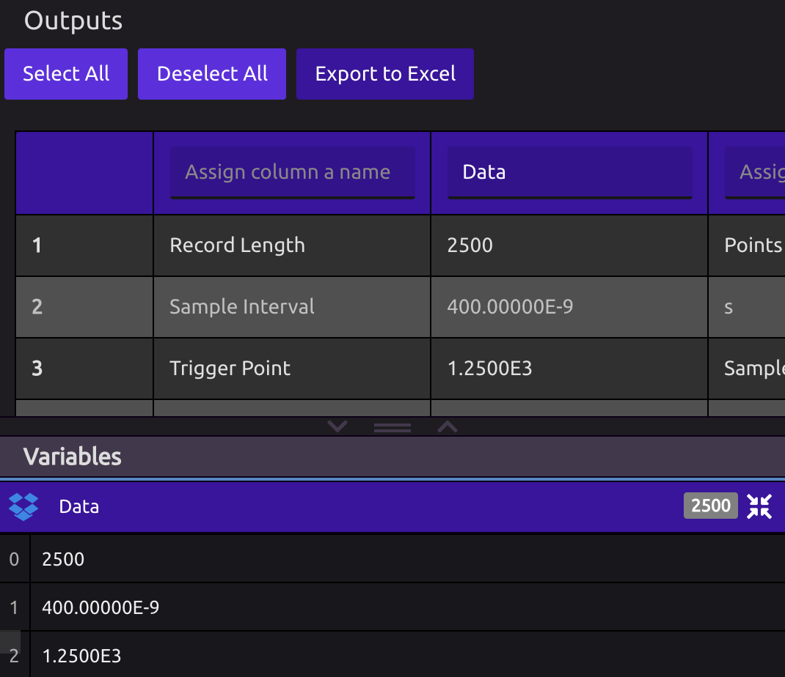
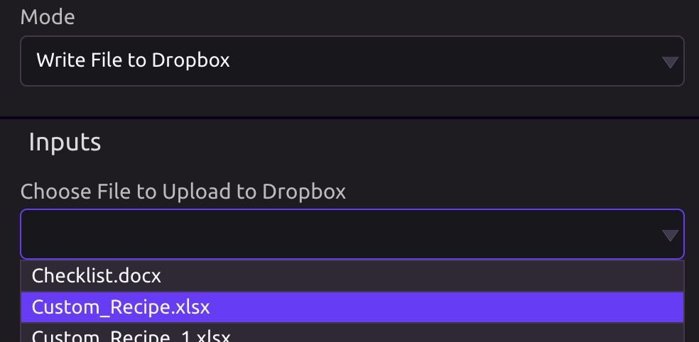
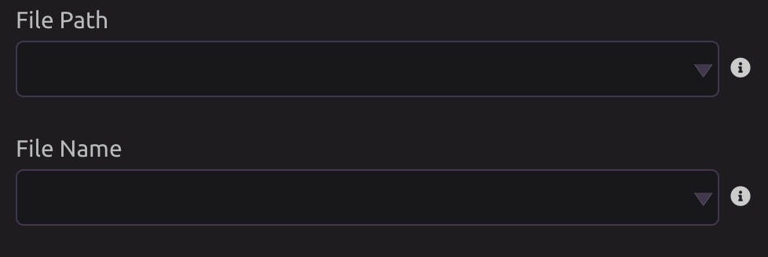

# Dropbox


## 🗝 Authorization

When you first drag in the Dropbox module, you will be asked to authenticate Dropbox with your WayScript account. Follow the prompts on the Dropbox site and authorize WayScript to access your Dropbox files.

##  Select an Account

You can connect multiple Dropbox accounts to WayScript. Select the one you would like to use.


## 📖 Read File from Dropbox

### 📁 Choose the File Type to Read

WayScript currently supports reading the following file types from Dropbox:

* [Word Documents](word.md) \(.docx\)
* [Excel Spreadsheets](excel.md) \(.xlsx\)
* [CSV Files](csv.md) \(.csv\)



### 👓 Choose a File Path to Read

Once you have selected a file type, select the path of the file you want to read.



### 📤 Outputs

####  Word

When you select a Word document, the following output is available:

```graphql
Doc = {
         paragraphs : [ String ],  
         full_text  : String, 
         words      : [ String ]
}
```

####  Excel or CSV

When you select an Excel or CSV file, you will see a preview of the contents in the Outputs section. Assign a name to each column whose contents you would like exported as a List.



## ✍ Write File to Dropbox

This mode allows you to upload a [file you have stored in WayScript](../../account-management/managing-your-files.md) to Dropbox.

### ⬆ Choose File to Upload to Dropbox

You will start by selecting one of your files to upload to Dropbox. Alternatively, you can upload a new file to WayScript.



### 📂 Provide a File Path and File Name

Once you have selected the file you wish to upload, provide the path in your Dropbox where you would like the file uploaded, as well as the name for the file.


The default file path is the root folder of your Dropbox and the default file name is the name of the file you selected to upload.




