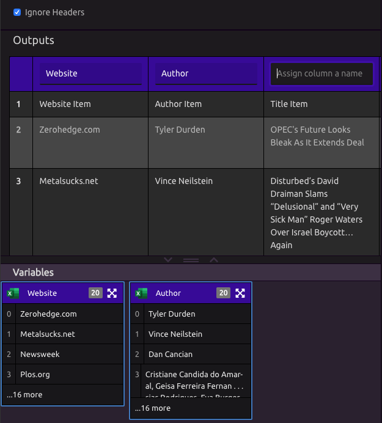
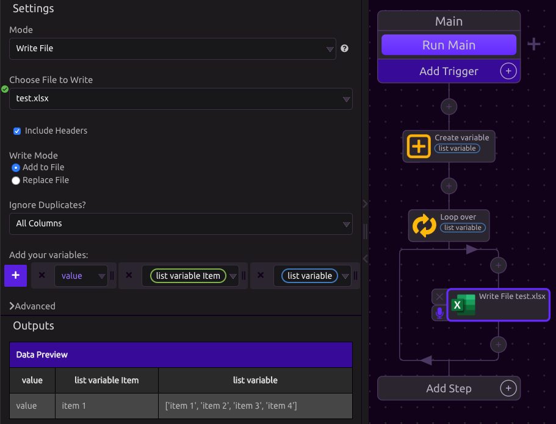

# Excel


WayScript supports Excel Files with extension 'xlsx'.


## Read File

Import columns from an Excel file as WayScript variables.

### Select or Upload Excel File

Excel files on your account will appear as options. Use the 'Upload File' button to add a new file.

### Select Sheet

Use the 'Sheet Name' Setting to select which sheet to read from your Excel file.

### Create Variables

Once a file is selected to read, A table with the file's contents will appear in the Outputs section. 

#### Ignore Headers

Specify whether or not to ignore the first line of the file when assigning variables.

#### Assigning Variables

Naming a column in the table creates a [List](../../introduction/variables.md#lists) variable with that name containing all entries in that column.

## Write File

### Select File

Use the file dropdown to select an existing file on your account or create a new one.

### Include Headers

If checked, the variable name will be written as the first row of each column.

### Write Mode

1. Add to File: Every time the program runs, new rows of data will be added to the bottom of the Excel file
2. Replace File: Every time the program runs, the file will be cleared before writing new data.


Headers will only be written when the file is blank. 

If 'Include Headers' is selected, changing a variable name when adding to an existing and non-empty file will not replace the header row.


### Ignore Duplicates

The Ignore Duplicates Setting makes it easier to avoid writing redundant data to your file.

When you select 'All Columns' or a specific column, the Excel Module will compare the new data to be written against the rows already in the file. If there is a match according to your selection, the new data will not be written. 

### Adding variables

Each time the Excel Module executes in Write Mode, one row of data is added.  


To write each entry of list to a new row, use a [Loop](../../introduction/looping-iteration.md).


### Sheet Name

Open the 'Advanced' section at the bottom of Settings to select a specific sheet in your Excel file to write to.

### Preview

As variables are added and removed, the Outputs section displays a preview of what will be written.

