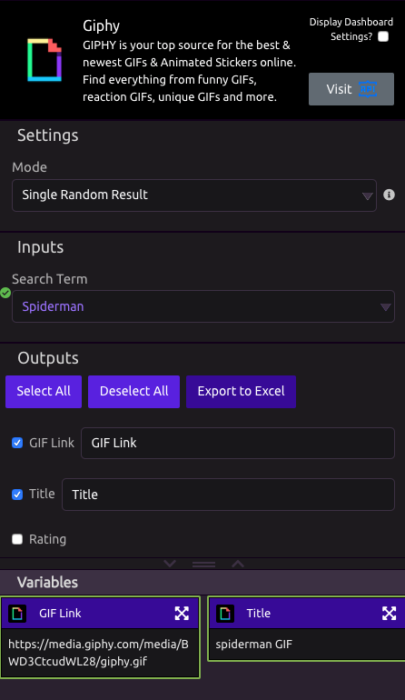

# Giphy


Check out the GIPHY [website](https://www.developers.giphy.com).


## ⚙ Mode

* **Single Random Result** - returns a single random result each time. 
  * This turns the Giphy outputs into [Single Items](../../getting_started/variables.md#single-item)
* **All Results** - All Results returns the top 25 results. 
  * This turns Giphy outputs in [Lists](../../getting_started/variables.md#lists)

## 📥 Inputs

* **Search Term** - This is the search term for the GIF you want. 

## 📤 Outputs


[Variable Type](../../getting_started/variables.md) of Outputs changes based on Mode above


* **GIF Link** - URL Link to the GIF
* **Title -** Name of the GIF
* **Rating** - Rating of the GIF
* **ID** - Programmatic ID of the GIF
* **JSON Data** - Raw JSON Data from the API call

