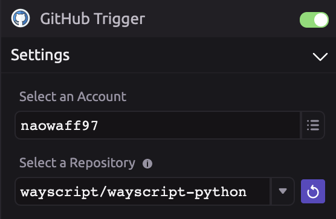

# GitHub




To run your script when GitHub events occur, use the [GitHub Trigger](../triggers/github-trigger.md).


## 👤 Search for a User

### 📥 Inputs

Search for metrics on a user account by:

* Username
* Email
* GitHub URL

### 📤 Outputs

```graphql
User_Data = {
    name : String,
    company : String, 
    username : String, 
    bio : String, 
    avatar_url : Url, 
    blog : Url, 
    created_at : Date, 
    email : String, 
    events_url : Url, 
    followers : Int, 
    followers_url : Url, 
    gists_url : Url, 
    gravatar_id : String, 
    hireable : Bool, 
    html_url : String, 
    id : Int, 
    location : String, 
    login : String, 
    node_id : String, 
    orgs_url : Url, 
    public_gists : Int, 
    public_repos : Int, 
    repos_url : Url, 
    site_admin : Bool, 
    starred_url : Url, 
    subscrip_url : Url, 
    type : String,
    updated_at : Date, 
    url : Url,
}
```

```graphql
User_Repo_Data = [
    {
        name : String, 
        description : String, 
        url : Url, 
        private : Bool, 
        forks : Int, 
        watchers : Int, 
        stargazers : Int, 
        open_issues : Int, 
        archived : Bool, 
        clone_url : Url, 
        contributors : Url, 
        created_at : Date,
        default_branch : String, 
        deployments_url : Url, 
        downloads_url : Url, 
        events_url : Url, 
        fork : Bool, 
        forks_url : Url, 
        full_name : String, 
        git_url : Url,
        has_downloads : Bool, 
        has_issues : Bool,
        has_pages : Bool, 
        has_projects : Bool, 
        has_wiki : Bool, 
        homepage : Url,
        hooks_url : Url, 
        html_url : Url, 
        id : Int, 
        language : String, 
        merges_url : Url, 
        node_id : String, 
        permissions : {
            admin : Bool, 
            pull : Bool, 
            push : Bool,
        },
        pushed_at : Date, 
        size : Int, 
        ssh_url : Url, 
        stargazers_url : Url, 
        subscribers_url : Url, 
        svn_url : Url,
        tags_url : Url,
        teams_url : Url, 
        updated_at : Date,
    },
]
```

## 🔎 Search for a Repo

### 📥 Inputs

Search for metrics on a repository by entering its Github URL.

### 📤 Outputs

Create variables for:

* Repo Name
* Repo Author Username
* Date Created
* Date of Last Update
* Date of Last Push
* Repo Size \(KB\)
* Number of Stars
* Subscriber Count
* Number of Forks
* Repo Language
* Open Issues Count
* Network Count
* Contributor Usernames
* Contributor URLs
* README content
* Raw JSON Data

## 🖊 Create an Issue

### 📥 Inputs

Create an issue for a repository by:

* GitHub Repo URL
* Title
* Content
* Labels
* Assignments 
* Milestone number

### 📤 Outputs

 Create variables for:

* Raw JSON Data

## 🖊 Edit an Issue

### 📥 Inputs

Edit an issue for a repository by:

* GitHub Issue URL
* Status
* Title
* Content
* Labels
* Assignments
* Milestone number

### 📤 Outputs

Create variables for:

* Raw JSON data

## 👓 View Issue Labels

### 📥 Inputs

View a list labels of an issue by:

* GitHub Issue URL

### 📤 Outputs

Create variables for:

* Label List
* Raw JSON data

## 👓 View Issue Assignees

### 📥 Inputs

View a list of users assigned to an issue by:

* GitHub Issue URL

### 📤 Outputs

Create variables for:

* Assignee List
* Raw JSON data

## 📓 Retrieve File Contents

### 📥 Inputs

Retrieve contents of a file in a repository by:

* GitHub Repo URL
* Path URL relative to GitHub URL
* Branch name

### 📤 Outputs

Create variables for:

* File Contents
* Raw JSON data

## 📚 Merge Into Branch 

### 📥 Inputs

Merge files into a branch by:

* Source Branch Name
* Destination Branch Name 
* Commit Message

### 📤 Outputs

Create variables for: 

* Success 
* Error 
* Raw JSON data

