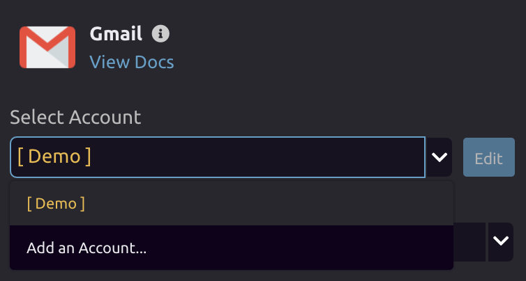
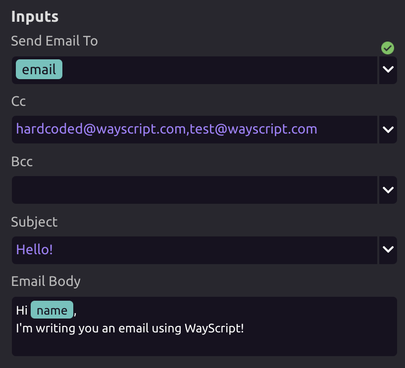

# Gmail

## ⚙ Setup

Select an account or add an account to work with Gmail.

## 📧 Send Email

### 👤 Send Email To

* You can input a [single item variable](../../getting_started/variables.md#single-item) or [hardcode](../../getting_started/modules.md#option-two-hardcode-a-value) an email address.
  * This is a required input.
* If you want to send to multiple emails, you can comma separate them. 

### 👥 CC/BCC

* You can input a [single item variable](../../getting_started/variables.md#single-item) or [hardcode](../../getting_started/modules.md#option-two-hardcode-a-value) an email address.
* If you want to send to multiple emails, you can comma separate them. 

### 🔤 Subject

* You can input a [single item variable](../../getting_started/variables.md#single-item) or [hardcode](../../getting_started/modules.md#option-two-hardcode-a-value) a subject.

### 📝 Body

* Build the email body and [insert variables](../../getting_started/modules.md#option-one-insert-a-variable) wherever you want. 

