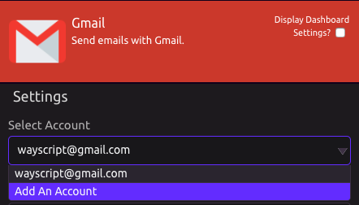
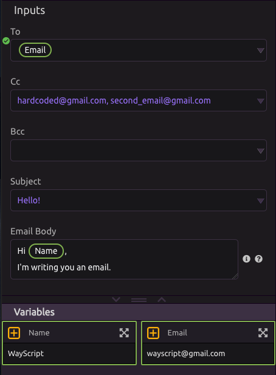

# Gmail


To run your script when Gmail messages change, use the [Gmail Trigger](../triggers/gmail-trigger.md).


## ⚙ Setup

Select an account or add an account to work with Gmail.

## 📧 Send Email

### 👤 To

* You can input a [single item variable](../../getting_started/variables.md#single-item) or [hardcode](../../getting_started/modules.md#option-two-hardcode-a-value) an email address.
* * This is a required input.
* If you want to send to multiple emails, you can comma separate them. 

### 👥 CC/BCC

* You can input a [single item variable](../../getting_started/variables.md#single-item) or [hardcode](../../getting_started/modules.md#option-two-hardcode-a-value) an email address.
* If you want to send to multiple emails, you can comma separate them. 

### 🔤 Subject

* You can input a [single item variable](../../getting_started/variables.md#single-item) or [hardcode](../../getting_started/modules.md#option-two-hardcode-a-value) a subject.

### 📝 Body

* Build the email body and [insert variables](../../getting_started/modules.md#option-one-insert-a-variable) wherever you want. 

## 📩 Import Emails

This mode pulls in data on all of the emails in your inbox. The outputs are all [lists](../../getting_started/variables.md#lists). 

### 📤 Outputs

* **All Email Recipients** - For each message, returns a list of ALL email recipients \(includes To and Cc\)
* **To Email Recipients** - All emails in the To section of the messages.
* **Cc Email Recipients** - All emails of those Cc'd on the messages.
* **Senders** - Email addresses of the people who sent the messages.
* **Subjects** - Subjects of the messages.
* **Body Snippets** - Snippets of the bodies of the messages.
* **Dates** - Date/Time each message was received.

