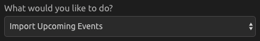
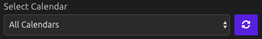
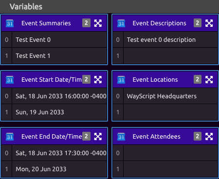

# Google Calendar

## Setup

Select the Google account you would like to work with.

## Create Event

#### Settings

Select a calendar. If you have recently added a calendar and do not see it, click the refresh button.

#### Inputs

* Event Summary
  * Required
  * This is the name of the event that will be displayed on your calendar.
* Event Start Date
  * Required
  * Must be of the format YYYY-MM-DD.
  * Example: 2020-07-04
* Event Start Time
  * This is in your local time.
* Event End Date
  * Required
  * Must be of the format YYYY-MM-DD.
  * Example: 2020-07-04
* Event End Time
  * This is in your local time.
* Event Location
* Event Description
* Event Attendees
  * Click the plus button to add as many attendees as you want.

Run the program to create the new event.

## Import Upcoming Events

#### Settings

Select a Calendar. Selecting 'All Calendars' will import events from all the calendars you can access from your Google Calendar account. If you have recently added a calendar and do not see it, click the refresh button.

Select what events you wish to import.


If you selected **Import a specified number of upcoming events**, enter the number of events you want imported. Default is 5.


#### Outputs

* Event Summaries
* Event Start Date/Time
* Event End Date/Time
* Event Descriptions
* Event Locations
* Event Attendees
* JSON Data

