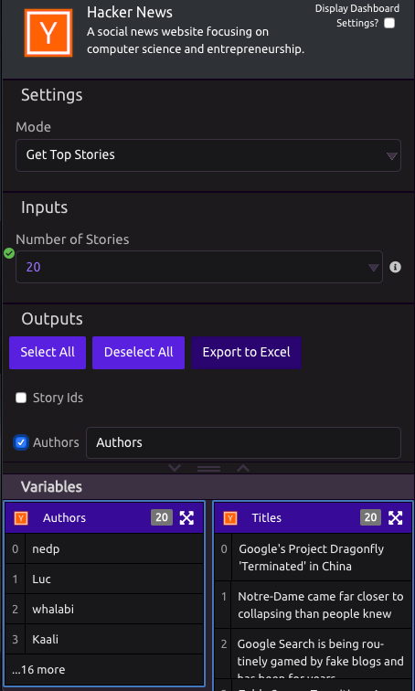

# Hacker News

## ⚙ Settings

###  Mode

* Get Top Stories
* Get New Stories
* Get Best Stories

## 📥 Inputs

* Number of Stories - Input the number of results you would like returned as outputs. 
  * Note - When the program is not running, only 20 results will be returned. 

## 📤 Outputs

* **Story IDs**
* **Authors**
* **Descendants** - Total Number of Comments
* **Kids** - The ids of the item's comments, in ranked display order.
* **Scores**
* **Times**
* **Titles**
* **URLs**
* **JSON Data**

