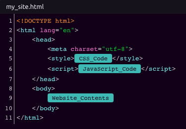

# HTML


Combine with an [HTTP Trigger](../triggers/http-trigger.md) and [HTTP Response](http-response.md) to serve content to a [web page](https://www.youtube.com/watch?v=OrZMjdVhFfA&feature=youtu.be).



See [Code Editors](../../getting_started/code-editors.md) for more information on composing code in WayScript.


## 📥 Inputs

You can write your HTML directly, as well as include variables.

HTML steps are pre-loaded with all of the tags that you need to get started building a website.


Include [CSS](css.md) and [JavaScript](javascript.md) outputs inline using the provided tags. You can also [import Images](images.md) and reference their URLs in an `` tag.


## 📤 Outputs

* HTML Code

