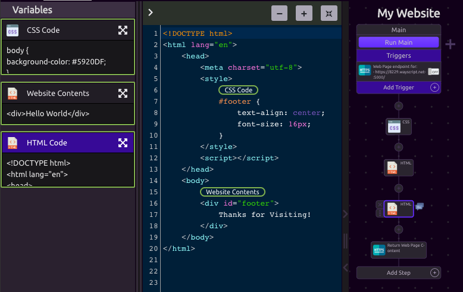

# HTML

HTML steps are pre-loaded with all of the tags that you need to get started building a website.


Combine with an HTTP Trigger and HTTP Step to serve content to a [web page](https://www.youtube.com/watch?v=OrZMjdVhFfA&feature=youtu.be).


## Inputs

You can write your HTML directly, as well as include variables.


Include [CSS](css.md) and [JavaScript](javascript.md) outputs inline using the provided tags.


## Outputs

* HTML Code

