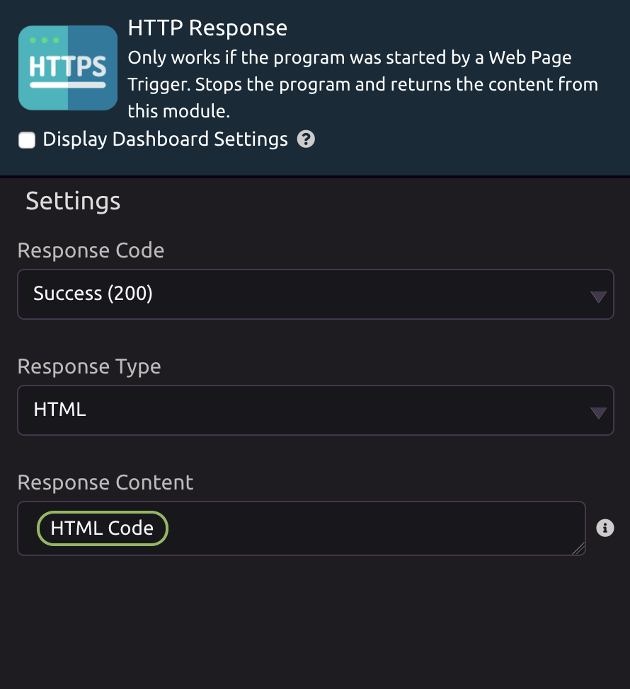

# HTTP Response

## ⚙ Setup

HTTP Response only works if the function was started by a HTTP Trigger. It will stop the program execution and return an HTTP response.

You can set the response code. The default is 200, which indicates that the request was successful. You can also return at redirect code \(302\), which will allow you to redirect to a different endpoint.

Next, set the response type. The default is HTML, but you can also return JSON data to implement a REST API.

Finally, set the content that you want to return in the Response Content field.

