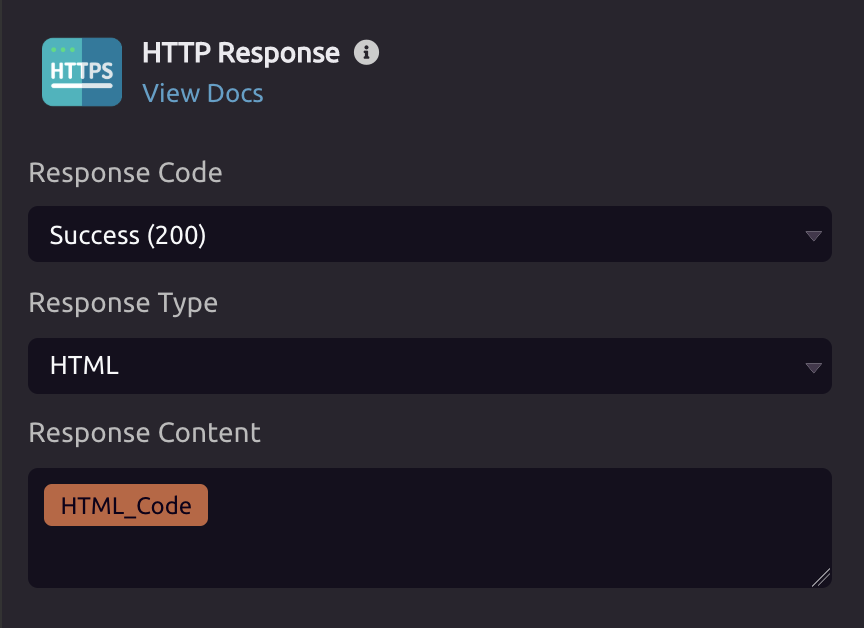

# HTTP Response


To trigger a function when a user goes to a URL, use the [HTTP Trigger](../triggers/http-trigger.md).


## ⚙ Setup

HTTP Response only works if the function was started by a [HTTP Trigger](../triggers/http-trigger.md). It will stop the program execution and return an HTTP response.

### Response Types

#### Success \(200\)

The default is 200, which indicates that the request was successful. Under 'Response Type', you can choose between HTML, JSON, or File Download.

* For **HTML**, you can return [HTML](html.md#outputs), [variables](../../getting_started/variables.md) or raw text in the 'Response Content' field.
* For **JSON**, you must select a [Struct variable](../../getting_started/variables.md#structs).
* For **File Download**, you can select a file from your account. This response will download the selected file to the user's machine.

#### Redirect \(301\)

You can pass a URL, which will allow you to redirect to a different endpoint.

