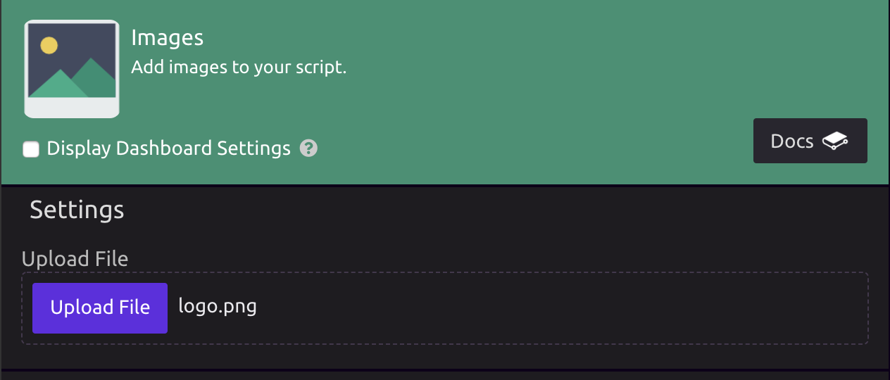
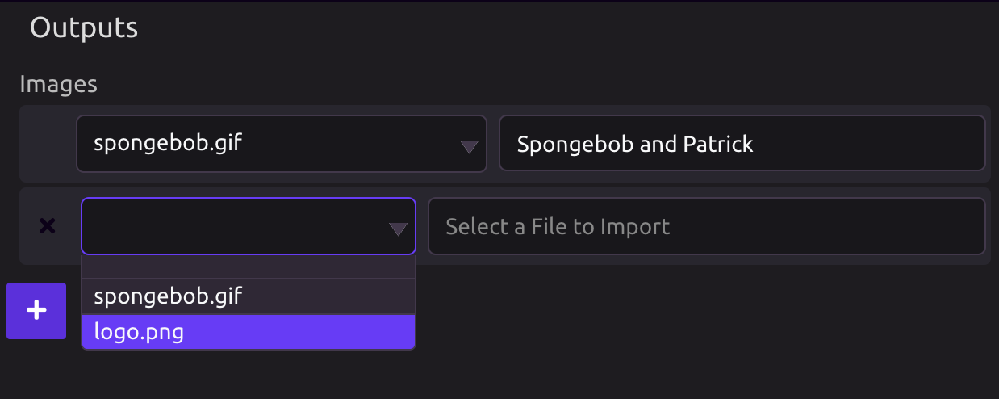
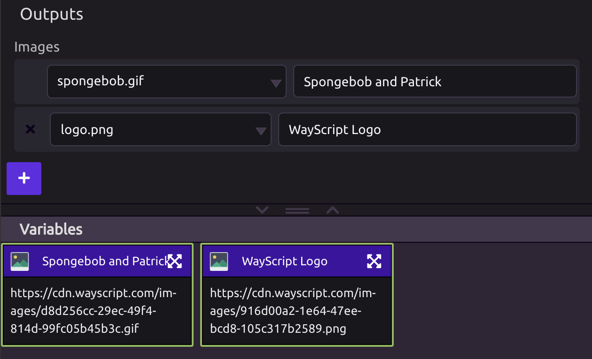

# Images

## 🖼 Upload an Image

If you haven't already uploaded the image you want to use to WayScript, click the "Upload File" button and import an image from your computer.

WayScript currently supports the following image file types:

* jpeg/jpg
* png
* bmp
* gif

## 📤 Output the URL

Once your image is uploaded, it will be available as an option in the "Images" output selector.

WayScript will automatically generate a URL for your image. For example, [https://cdn.wayscript.com/images/916d00a2-1e64-47ee-bcd8-105c317b2589.png](https://cdn.wayscript.com/images/916d00a2-1e64-47ee-bcd8-105c317b2589.png) was generated for "logo.png" in the image below.

You can then use these variables as you would any other variable in WayScript. For example, you could drag the URL into an `` tag in the [HTML module](html.md) to add an image to a [webpage](https://www.youtube.com/watch?reload=9&v=OrZMjdVhFfA&feature=youtu.be).

