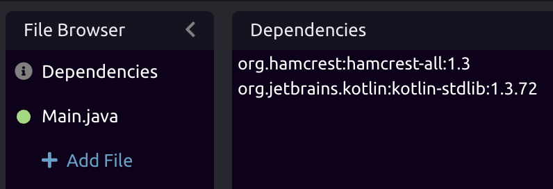
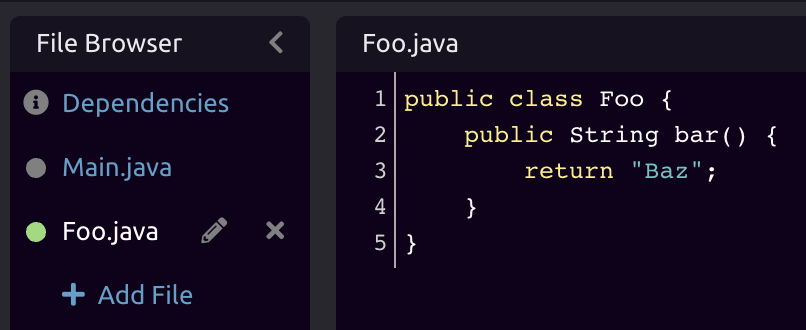
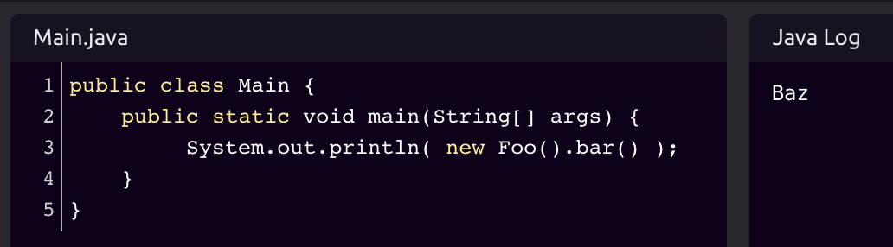

# Java



See [Code Editors](../../../getting_started/code-editors.md) for more information on composing code in WayScript.


## Working with Variables

### 📥 Inputs

WayScript's Java editor lets you reference [Variables](../../../getting_started/variables.md) that exist in your program. To do this, you can reference them through the **variables map**.


Your WayScript variables are defined as a static `Map<String, Object>` in the `WayScript` class.


As an example, let's create a variable called "Location" and set a value of "Brooklyn, NY"


You can reference the String-type `Location` variable in Java with this code:

```java
// Since all WayScript variables are Java Objects,
// call "toString" to convert to a String representation
String location = WayScript.variables.get( "Location" ).toString();

// Or cast to a String, if you know it's a string variable
String location = (String)WayScript.variables.get( "Location" );
```

More abstractly, you reference a variable of any type by declaring it as an Object:

```java
Object var = WayScript.variables.get( "<var_name>" );
```


You can cast your variables to other types as well, depending on the type of the variable, as declared in WayScript. For example, suppose you have a variable, "Length," that is a WayScript Float. You can consume that variable as a `Double` in your Java code by casting it as such:  
  
`Double var = (Double)WayScript.variables.get( "Length" );`


### 📤 Outputs

You can also output data from your Java code and turn these into variables that can be used by other [Modules](../../../getting_started/modules.md) in your program.

You can do this with the **variables map** in the following format:

```java
WayScript.variables.put( "<Var Name>", variable );
```


WayScript outputs can only be data structures such as strings, lists, maps, etc., but cannot be class objects.


## ▶ Running Java

While working on your script, you can press the "Run Code" button inside the Java module to run the your code and see updated results.


To run a Java class, the file name _must_ match the class name, and the class _must_ contain a main method whose signature is `public static void main(String[] args)`


## 📦 Adding Additional Maven Dependencies

The Java module comes with [many pre-installed Java Packages](packages.md#available-java-packages). However, if you would like to use a package that isn't already installed, you can declare those in the "Dependencies" tab.

WayScript uses [Maven](https://mvnrepository.com/) to install dependencies. Declare these dependencies as you would any [mvn dependency](https://maven.apache.org/ref/3.6.3/maven-model/maven.html#class_dependency), in the format of `groupId:artifactId:version`, e.g. `org.apache.maven:maven-artifact:3.2.1`, placing one dependency on each line.




For faster code execution, only add dependencies that aren't already [pre-installed](packages.md#available-java-packages) in the Java module.


## ↘ Using Code from Other Classes

You can use code from the other Java classes in your File Browser. For example, suppose you have a class called `Foo.java`, which has a method `bar`.



The `Foo` class and `bar` method will be available for use in `Main.java`:



## 🎓 Tutorial



