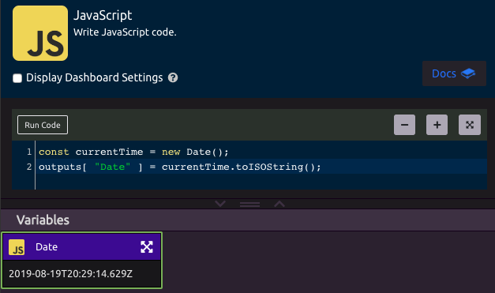
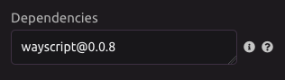

# JavaScript


##  Inputs

WayScript's JS editor lets you reference [Variables](../../getting_started/variables.md) that exist in your program. To do this, you can reference them through the **inputs dictionary**.

As an example, let's create a variable called "Location" and set a value of "Brooklyn, NY"


You can reference the Location variable in your JavaScript with this code:

```javascript
location = inputs[ "Location" ];

// Or, as a JS object
location = inputs.Location;
```

More abstractly, you reference any variable with the format:

```javascript
const my_var = inputs[ "<var_name>" ];
```


##  Outputs

You can also output data from your JS code and turn these into variables that can be used by other [Modules](../../getting_started/modules.md) in your program. 

You can do this with the **outputs dictionary** in the following format:

```javascript
outputs[ "<Var Name>" ] = variable;

// example
const currentTime = new Date();
outputs[ "Date" ] = currentTime.toISOString();
```



## ▶ Running JavaScript

While working on your code, you can press the "Run Code" button inside the module to run the JavaScript and see updated results.

## 📦 Adding Dependencies

If you would like to use an [npm](https://www.npmjs.com/) module in your code, you can declare those dependencies in the "Dependencies" field.

Declare these dependencies on separate lines, using the format you would for an [npm-install](https://docs.npmjs.com/cli/install) command.



You can then consume these packages in your code:

```javascript
const wayscript = require( 'wayscript' );

wayscript.apiKey = 'YOUR_API_KEY';

let programId = 1234;
wayscript.runProgram( programId );
```

