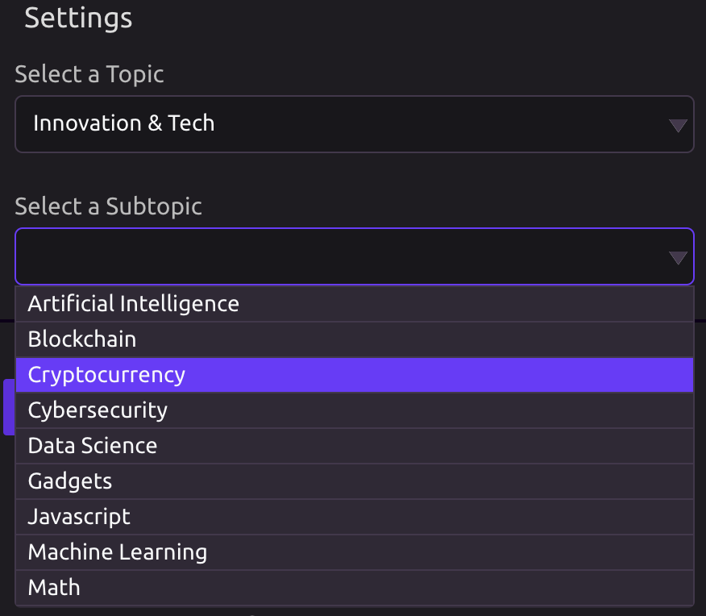

# Medium

## ⚙Select a Topic

Choose between:

* 🎭 Arts & Entertainment
* 🏭 Industry
* 💻 Innovation & Tech
* 🏡 Life
* 🏙 Society

## 🔎Select a Subtopic

Choose one of the many subtopics for the main topic you chose above.

## 📤Output

Create variables for:

* Article Title
* Article Subtitle
* Article Clap Count
* Number of Recommendations
* Number of Comments
* Author Name
* Article URL
* Author Page URL
* Author Bio
* Author Twitter Handle
* Article Word Count
* Article Image Count
* Time to Read
* Article URL References
* Raw JSON Data


Each variable contains a list of values.


