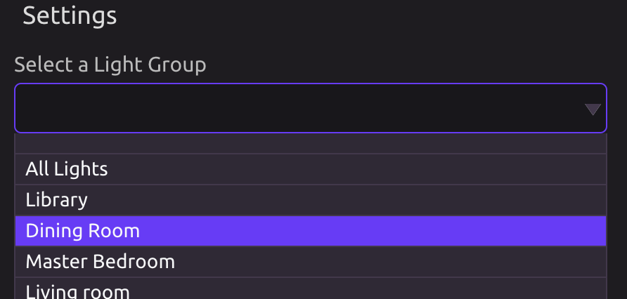
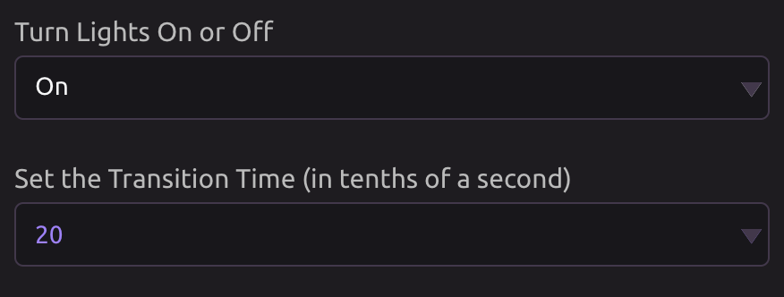

# Phillips Hue

## Select a Light Group

Select one of your Phillips Hue light groups.

## Turn Lights On or Off

Set whether you would like this light group to turn on or off, and how long you want that transition to take \(in tenths of a second\).

