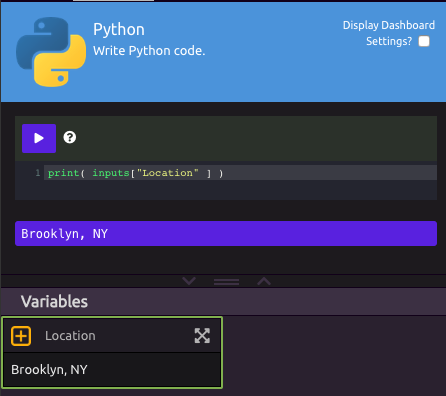
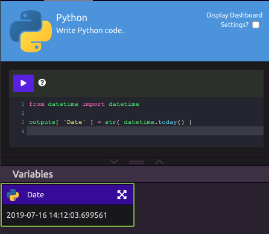

# Python


##  Inputs

WayScript's python editor lets you reference [Variables](../../../getting_started/variables.md) that exist in your program. To do this, you can drag your variables into the codebox or reference them through the **inputs dictionary**.

As an example, let's create a variable called "Location" and set a value of "Brooklyn, NY"


You can reference the Location variable in your python script with this code:

```python
location = inputs[ "Location" ]
```

More abstractly, you reference any variable with the format:

```python
var = inputs[ "<var_name>" ] 
```



## Outputs

You can also output data from your python scripts and turn these into variables that can be used by other [Modules](../../../getting_started/modules.md) in your program. 

You can do this with the **outputs dictionary** in the following format:

```python
outputs[ "<Var Name>" ] = variable

# example
from datetime import datetime
outputs[ "Date" ] = str( datetime.today() )
```



## ▶Running Python

While working on your script, you can press the \("play"\) button inside the Python module to run the Python code. 

