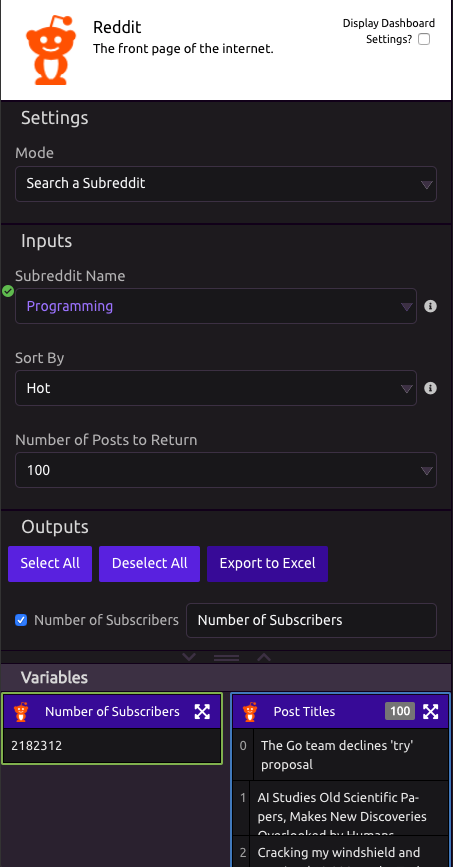
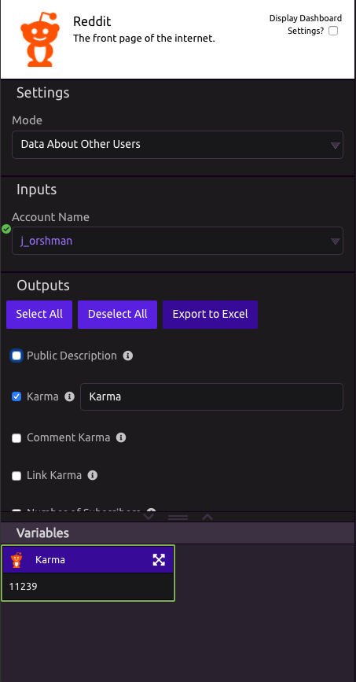

# Reddit

## 👤 Data About My Account

### 📤 Outputs

* **Public Description** - Users public description
* **Karma** - Total Karma from Comments and Links
* **Comment Karma** - Total Karma from Comments
* **Link Karma** - Total Karma from Links
* **Number of Subscribers** - Total Number of Account Subscribers
* **Account Has Gold** - Returns True or False
* **JSON Data** - Raw JSON of the API query response

## 🔎 Search a Subreddit

### 📥 Inputs

* **Subreddit Name** - The name of the subreddit \(ex - '[programming](https://www.reddit.com/r/programming/)'\)
* **Sort By**
  * **Options** - Hot, Top, New, Controversial, Rising, Random
* **Number of Posts to Return** - How many posts you want to be outputted. 

### 📤 Outputs

* **Number of Subscribers** - Total number of subscribers
* **Active Accounts** - The number of accounts currently online
* **Subreddit Description** - Subreddits description
* **Post Titles** - A [List](../../getting_started/variables.md#lists) of the Titles of the Subreddit Posts
* **Date of Post \(UTC\)** - ****A List of the Dates that the posts were published
* **Post Text** - A List of the Text of the Subreddit Posts
* **Post Author** - A List of the Authors of the Subreddit Posts
* **Number of Upvotes** - A List of the Number of Upvotes of the Subreddit Posts
* **Number of Comments** - A List of the Number of Comments of the Subreddit Posts
* **Post Reddit URLs** - A List of the Reddit URLs of the Posts
* **Post Link URLs** - If the post is a link to another website, this will be the URL of the link
* **JSON Data -** Raw JSON of the API query response

## 👥 Data About Other Users

### 📥 Inputs

* **Account Name** - account name of the user. 

### 📤 Outputs

* **Public Description** - Users public description
* **Karma** - Total Karma from Comments and Links
* **Comment Karma** - Total Karma from Comments
* **Link Karma** - Total Karma from Links
* **Number of Subscribers** - Total Number of Account Subscribers
* **Account Has Gold** - Returns True or False
* **JSON Data** - Raw JSON of the API query response

## 📌 Get Posts from Other Users

Pull in the posts of a user by their username. 

### 📥 Inputs

* **Number of Posts to Return** - How many posts you want to be outputted. 
* **Account Name -** account name of the user. 

### 📤 Outputs

* **Number of Subscribers** - The number of subscribers to Account Name
* **List of Subbreddits the Posts Belong To** - A list of the subreddits each post was posted to
* **Post Titles** - A list of the titles of each post
* **Date of Post \(UTC\)** - A list of the dates of each post
* **Post Text** - A list of the text of each post
* **Number of Upvotes** - A list of the number of upvotes of each post
* **Number of Comments** - A list of the number of comments of each post
* **Post Reddit URLs** - A list of the urls of each reddit post
* **Post Link URLs** - A list of the urls mentioned in each post
* **JSON Data**  - Raw JSON of the API query response 

## 💬 Get Comments from Other Users

### 📥 Inputs

* **Number of Posts to Return** - How many posts you want to be outputted. 
* **Account Name -** account name of the user. 

### 📤 Outputs

* **Comment Text** - A List of the text of the Comments
* **Date of Comment \(UTC\)** - A list of the date that the comment was published
* **Number of Comments** - A list of the Number of Comments on the Comments
* **Number of Upvotes** - A List of the Number of Upvotes on the Comments
* **List of Subbreddits the Comments Belong To** - A list of the subreddits each post was posted to
* **Comment Reddit URLs** - A List of the URLs of the Comments
* **Comment Link URLs** - A list of the urls mentioned in each comment
* **JSON Data** - Raw JSON of the API query response

