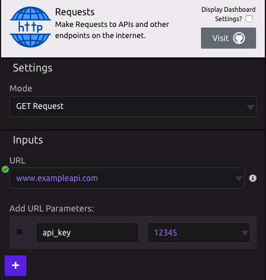

# Requests


Check out the Requests library on [GitHub](https://github.com/requests/requests).


## ⚙ Settings

###  Mode

* GET Request - used to request data from a specified resource
* POST Request - used to send data to a server to create/update a resource

## 📥 Inputs

* **URL** - The URL you are requesting
* **Add URL Parameters** - The query string name/value pairs.

This example calls: [https://www.exampleapi.com?api\_key=12345](https://www.exampleapi.com?api_key=12345)

### 💡 Advanced Inputs

* **Add URL Headers** - Name/Value pairs of headers information.
* **Add URL Data** - Name/Value paris of data information.

## 📤 Outputs

* **JSON Data** - Raw JSON recieved from the endpoint

