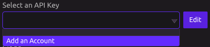
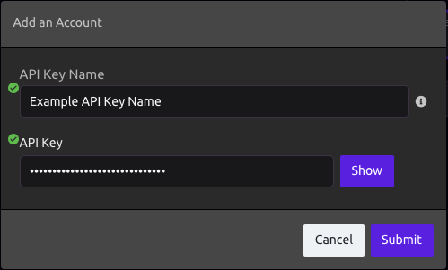
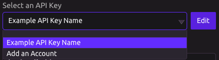

# RocketReach


## ⚙ Setup



Under **Select an API Key**, click **Add an Account**.



A popup will appear, allowing you to enter your RocketReach API key and name for reference. If you do not have a RocketReach account, visit [https://rocketreach.co/signup](https://rocketreach.co/signup) to create one. Click **Submit** to confirm.



Now you can select the API key that you just added. If you wish to change the name or API key, simply click the edit button and the popup will reappear. If you wish to add another API key, click **Add an Account**.

## 👤 Lookup Profile



Returns data for a single matching profile.


### 🆔 By ID

#### 📥 Inputs

* Id - RocketReach profile Id

### 🔗 By LinkedIn URL

#### 📥 Inputs

* LinkedIn URL

### 📔 By Name and Current Employer

#### 📥 Inputs

* Name
* Current Employer

#### 📤 Output

```graphql
Profile = {
    name : String,
    current_employer : String, 
    current_title : String, 
    personal_email : String, 
    work_email : String, 
    emails : [
        {
            email : String, 
            smtp_valid : String, 
            type : String, 
        },
    ],
    linkedin_url : Url,
    links : {
         aboutme : Url,
         amazon : Url, 
         angel : Url, 
         angellist : Url,
         crunchbase : Url,
         facebook : Url,
         github : Url,
         google : Url,
         google_plus : Url,
         gravatar : Url,
         hi5 : Url,
         instagram : Url,
         klout : Url,
         linkedin : Url,
         meetup : Url,
         pinterest : Url,
         quora : Url,
         salesforce : Url,
         twicsy : Url,
         twitter : Url,   
    },
    location : String, 
    phones : [
        String,
    ],
    profile_pic : Url,
    id : Int,
}
```

## 🔎 Search



Return data from multiple profiles matching the search criteria.


#### 📥 Inputs

* Keywords
  * Press the blue plus button to add any number of keywords.
* Name
* Job Title
* Company
* Location

#### 📤 Output

```graphql
Profiles = [
    {
        name : String,
        city : String,
        country_code : String, 
        current_employer : String,
        current_title : String,
        id : Int,
        location : String, 
        profile_pic : Url,
        region : String,
    },
]
```

