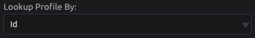
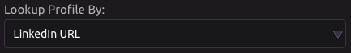
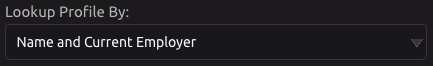

# RocketReach

## ⚙ Setup

Under **Select an API Key**, click **Add an Account**.

A popup will appear, allowing you to enter your RocketReach API key and name for reference. If you do not have a RocketReach account, visit [https://rocketreach.co/signup](https://rocketreach.co/signup) to create one. Click **Submit** to confirm.

Now you can select the API key that you just added. If you wish to change the name or API key, simply click the edit button and the popup will reappear. If you wish to add another API key, click **Add an Account**.

## 👤 Lookup Profile


Returns data for a single matching profile.


### 🆔 By ID

#### 📥 Inputs

* Id - RocketReach profile Id

#### 📤 Outputs

* Id
* Current Employer
* Current Title
* Profile Picture
* LinkedIn URL
* Current Personal Email
* Current Work Email
* Location
* Name
* Link Accounts
  * Each account is matched to a URL at the same index in **Link URLs**.
* Link URLs
  * Each URL is matched to an account at the same index in **Link Accounts**.
* Phones
* Email SMTP Valid
  * Each SMTP Valid item is matched to an email address in **Email Addresses**.
* Email Addresses
  * Each email address is matched to an SMTP Valid item in **Email SMTP Valid**.
* JSON Data
  * Raw JSON data received from the API.

### 🔗 By LinkedIn URL

#### 📥 Inputs

* LinkedIn URL

#### 📤 Outputs

* Id
* Current Employer
* Current Title
* Profile Picture
* LinkedIn URL
* Current Personal Email
* Current Work Email
* Location
* Name
* Link Accounts
  * Each account is matched to a URL at the same index in **Link URLs**.
* Link URLs
  * Each URL is matched to an account at the same index in **Link Accounts**.
* Phones
* Email SMTP Valid
  * Each SMTP Valid item is matched to an email address in **Email Addresses**.
* Email Addresses
  * Each email address is matched to an SMTP Valid item in **Email SMTP Valid**.
* JSON Data
  * Raw JSON data received from the API.

### 📔 By Name and Current Employer

#### 📥 Inputs

* Name
* Current Employer

#### 📤 Outputs

* Id
* Current Employer
* Current Title
* Profile Picture
* LinkedIn URL
* Current Personal Email
* Current Work Email
* Location
* Name
* Link Accounts
  * Each account is matched to a URL at the same index in **Link URLs**.
* Link URLs
  * Each URL is matched to an account at the same index in **Link Accounts**.
* Phones
* Email SMTP Valid
  * Each SMTP Valid item is matched to an email address in **Email Addresses**.
* Email Addresses
  * Each email address is matched to an SMTP Valid item in **Email SMTP Valid**.
* JSON Data
  * Raw JSON data received from the API.

## 🔎 Search


Return data from multiple profiles matching the search criteria.


#### 📥 Inputs

* Keywords
  * Press the blue plus button to add any number of keywords.
* Name
* Job Title
* Company
* Location

#### 📤 Outputs

* Ids
* Names
* Profile Pictures
* Locations
* Cities
* Regions
* Country Codes
* Current Titles
* Current Employers
* JSON Data
  * Raw JSON data received from the API.


Data for a single profile can be found at the same index of each output list.


