# Salesforce



To run your script when a Salesforce object is created or updated, use the [Salesforce Trigger](../triggers/salesforce-trigger.md).


## ⚙ Setup

### 🔑 API Access

First make sure you have API access enabled in Salesforce. To do this, follow [these instructions](https://ebstalimited.zendesk.com/hc/en-us/articles/229295368-How-do-I-enable-API-access-in-Salesforce).

### 💡 Object IDs

Many of the modes of the Salesforce module utilize object IDs. This is how the API identifies the Salesforce objects. These IDs can be found in the url when viewing the object.

For Salesforce classic the ID will be at the end of the url. In the following example url, **0014P000025KpT7** is the object ID:                                                                               [https://na132.salesforce.com/0014P000025KpT7](https://na132.salesforce.com/0014P000025KpT7)

For Salesforce Lighting Experience, the ID is the second to last section of the url. In the following example url, **7014P000000vMXUQA2** is the object ID: [https://na132.lightning.force.com/lightning/r/Campaign/7014P000000vMXUQA2/view](https://na132.lightning.force.com/lightning/r/Campaign/7014P000000vMXUQA2/view)

##  New Object

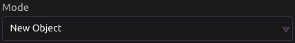

### 🌟 Create New Account


#### 📥 Inputs

* **Account Name** 
  * Required
* **Parent Account ID**
  * Click [here](salesforce.md#object-ids) for more information about object IDs.
* **Account Number**
* **Account Site**
* **Type**
* **Industry**
* **Annual Revenue**
* **Phone Number**
* **Fax**
* **Website**
* **Rating**
* **Ticker Symbol**
* **Ownership**
* **Employees**
* **SIC Code**
* **Billing Address**
  * Separated by Street, City, State, Zip, and Country fields
* **Shipping Address**
  * Separated by Street, City, State, Zip, and Country fields
* **Description**

#### 📤 Outputs

* **New Account ID**
  * After successfully running the program and creating a new account, this output will be the corresponding object ID.
  * Click [here](salesforce.md#object-ids) for more information about object IDs.

### 📈 Create New Campaign

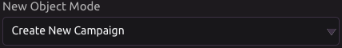

#### 📥 Inputs

* **Campaign Name**
  * Required
* **Active**
  * Check the box if you wish the new campaign to be marked as active.
* **Type**
* **Status**
* **Start Date**
  * Must be of the format YYYY-MM-DD
  * Example: 2020-07-04
* **End Date**
  * Must be of the format YYYY-MM-DD
  * Example: 2020-07-04
* **Expected Revenue**
* **Budgeted Cost**
* **Actual Cost**
* **Expected Response**
* **Number Sent in Campaign**
* **Parent Campaign ID**
  * Click [here](salesforce.md#object-ids) for more information about object IDs.
* **Description**

#### 📤 Outputs

* **New Campaign ID**
  * After successfully running the program and creating a new campaign, this output will be the corresponding object ID.
  * Click [here](salesforce.md#object-ids) for more information about object IDs.

### 💼 Create New Case


#### 📥 Inputs

* **Subject**
* **Status**
* **Case Origin**
* **Contact ID**
  * ID of the associated contact.
  * Click [here](salesforce.md#object-ids) for more information about object IDs.
* **Account ID**
  * ID of the associated account.
  * Click [here](salesforce.md#object-ids) for more information about object IDs.
* **Type**
* **Case Reason**
* **Priority**
* **Web Email**
* **Web Name**
* **Web Company**
* **Web Phone**
* **Description**

#### 📤 Outputs

* **New Case ID**
  * After successfully running the program and creating a new case, this output will be the corresponding object ID.
  * Click [here](salesforce.md#object-ids) for more information about object IDs.

### 💬 Create New Case Comment

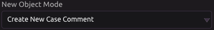

#### 📥 Inputs

* **Body**
  * Required
* **Published**
  * Check the box if you wish the new case comment to be visible to customers in the Self-Service portal.
* **Parent ID**
  * Required
  * The ID of the case that the comment is being added to.
  * Click [here](salesforce.md#object-ids) for more information about object IDs.

#### 📤 Outputs

* **New Case Comment ID**
  * After successfully running the program and creating a new case comment, this output will be the corresponding object ID.
  * Click [here](salesforce.md#object-ids) for more information about object IDs.

### 👤 Create New Contact

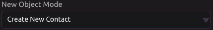

#### 📥 Inputs

* **Salutation**
* **First Name**
* **Last Name**
  * Required
* **Account ID**
  * ID of the account that is the parent of this contact.
  * Click [here](salesforce.md#object-ids) for more information about object IDs.
* **Title**
* **Department**
* **Birthdate**
  * Must be of the format YYYY-MM-DD
  * Example: 2020-07-04
* **Reports To \(ID\)**
  * The ID of who this contact reports to.
  * Click [here](salesforce.md#object-ids) for more information about object IDs.
* **Lead Source**
* **Phone Number**
* **Home Phone**
* **Mobile**
* **Other Phone**
* **Fax**
* **Email**
* **Assistant**
  * The name of the assistant.
* **Asst. Phone**
  * The phone number of the assistant.
* **Mailing Address**
  * Separated by Street, City, State, Zip, and Country fields
* **Other Address**
  * Separated by Street, City, State, Zip, and Country fields
* **Description**

#### 📤 Outputs

* **New Contact ID**
  * After successfully running the program and creating a new contact, this output will be the corresponding object ID.
  * Click [here](salesforce.md#object-ids) for more information about object IDs.

### 🗓 Create New Event


#### 📥 Inputs

* **Subject**
  * Required
* **All-Day Event**
  * Check this box if the event takes all day \(can span multiple days as well\)
* **Start Date**
  * Required
  * Must be of the format YYYY-MM-DD
  * Example: 2020-07-04
* **Start Time**
  * This is only visible if **All-Day Event** is unchecked.
  * This is in your local time.
* **End Date**
  * Required
  * Must be of the format YYYY-MM-DD
  * Example: 2020-07-04
  * If **All-Day Event** is checked, setting this to the same day as the start will create an event lasting that whole day. If **End Date** is set to the next day, a two-day event will be created.
* **End Time**
  * This is only visible if All-Day Event is unchecked.
  * This is in your local time.
* **Location**
* **Name ID**
  * The ID of a human object, such as a contact or lead that is involved with the event.
  * Click [here](salesforce.md#object-ids) for more information about object IDs.
* **Related To ID**
  * The ID of a non-human object, such as an opportunity or campaign that this event is related to.
  * Click [here](salesforce.md#object-ids) for more information about object IDs.
* **Description**

#### 📤 Outputs

* **New Event ID**
  * After successfully running the program and creating a new event, this output will be the corresponding object ID.
  * Click [here](salesforce.md#object-ids) for more information about object IDs.

### 🕵 Create New Lead


#### 📥 Inputs

* **Salutation**
* **First Name**
* **Last Name**
  * Required
* **Company**
  * Required
* **Lead Status**
* **Title**
* **Lead Source**
* **Industry**
* **Annual Revenue**
* **Phone Number**
* **Mobile**
* **Fax**
* **Email**
* **Website**
* **Rating**
* **No. of Employees**
* **Address**
  * Separated by Street, City, State, Zip, and Country fields
* **Description**

#### 📤 Outputs

* **New Lead ID**
  * After successfully running the program and creating a new lead, this output will be the corresponding object ID.
  * Click [here](salesforce.md#object-ids) for more information about object IDs.

### 🗒 Create New Note

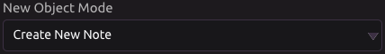

#### 📥 Inputs

* **Parent ID**
  * Required
  * The ID of the object this note will be attached to.
  * Can only be an account, contact, lead, or opportunity.
* **Title**
  * Required
* **Body**
* **Private**
  * Check this box if you want to be the only one who can see this note.

#### 📤 Outputs

* **New Note ID**
  * After successfully running the program and creating a new note, this output will be the corresponding object ID.
  * Click [here](salesforce.md#object-ids) for more information about object IDs.

### ✨ Create New Opportunity

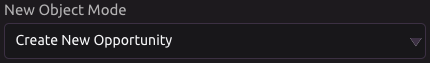

#### 📥 Inputs

* **Private**
  * Check this box if you want the new opportunity to be private.
* **Opportunity Name**
  * Required
* **Close Date**
  * Required
  * Must be of the format YYYY-MM-DD
  * Example: 2020-07-04
* **Stage**
* **Account ID**
  * ID of the associated account.
  * Click [here](salesforce.md#object-ids) for more information about object IDs.
* **Type**
* **Lead Source**
* **Amount**
* **Next Step**
* **Probability \(%\)**
* **Primary Campaign Source ID**
  * ID of the primary campaign source.
  * Click [here](salesforce.md#object-ids) for more information about object IDs.
* **Description**

#### 📤 Outputs

* **New Opportunity ID**
  * After successfully running the program and creating a new opportunity, this output will be the corresponding object ID.
  * Click [here](salesforce.md#object-ids) for more information about object IDs.

### 📋 Create New Task


#### 📥 Inputs

* **Subject**
  * Required
* **Due Date**
  * Must be of the format YYYY-MM-DD
  * Example: 2020-07-04
* **Priority**
* **Status**
* **Name ID**
  * The ID of a human object, such as a contact or lead that is involved with the event.
  * Click [here](salesforce.md#object-ids) for more information about object IDs.
* **Related To \(ID\)**
  * The ID of a non-human object, such as an opportunity or campaign that this event is related to.
  * Click [here](salesforce.md#object-ids) for more information about object IDs.
* **Description**

#### 📤 Outputs

* **New Task ID**
  * After successfully running the program and creating a new task, this output will be the corresponding object ID.
  * Click [here](salesforce.md#object-ids) for more information about object IDs.

### 👥 Add New Campaign Member

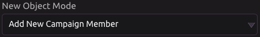

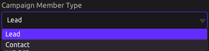

#### 📥 Inputs

* **Campaign ID**
  * The ID of the campaign you are adding a member to.
  * Click [here](salesforce.md#object-ids) for more information about object IDs.
* **Member Lead/Contact ID**
  * The ID of the lead/contact \(depending on which type you selected earlier\) you are adding to the campaign.
  * Click [here](salesforce.md#object-ids) for more information about object IDs.
* **Member Status**

#### 📤 Outputs

* **New Campaign Member ID**
  * After successfully running the program and adding a new campaign member, this output will be the corresponding object ID.
  * Click [here](salesforce.md#object-ids) for more information about object IDs.

## ❔ Query

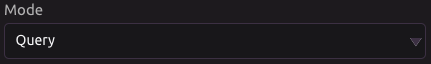

### 🔎 Interacting With Query Results

After executing a successful query, you will see something like this under **Outputs**.

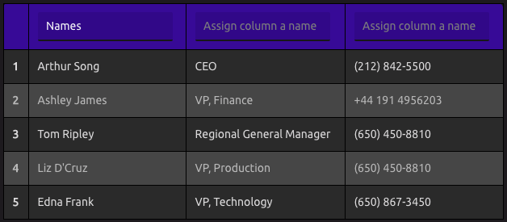

To make a column into a variable, simply assign the column a name. The resulting variable will look like this:

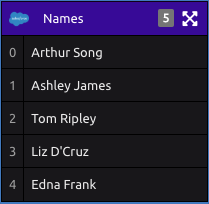

If you wish to view the raw JSON returned from the query, simply select the **JSON Data** checkbox under **Outputs**.

### ✂ Custom Query

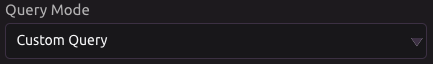

Write the query code in the code box, using Salesforce's SOQL querying language.


See [https://developer.salesforce.com/docs/atlas.en-us.soql\_sosl.meta/soql\_sosl/sforce\_api\_calls\_soql.htm](https://developer.salesforce.com/docs/atlas.en-us.soql_sosl.meta/soql_sosl/sforce_api_calls_soql.htm) for more details.


Example:

```sql
SELECT id, name
FROM Account
WHERE name = 'Example Account'
LIMIT 1
```

Click the run button to execute the query.

[Interacting with query results.](salesforce.md#interacting-with-query-results)

### 👤 Query Accounts

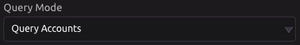

#### ☑ Select Fields to be Returned

* Account ID
* Account Name
* Account Number
* Account Phone

These represent the columns of results from a successful query.

#### 📥 Inputs


Query All Accounts


If selected, the query will not filter its results.


Query All Accounts


If unselected, there will be options to filter results by any of the following fields.

* ID
  * Click [here](salesforce.md#object-ids) for more information about object IDs.
* Account Name
* Type
* Industry
* Rating

This will return results that match any fields with inputted values.

**Limit** - Optional limit on the number of rows to be returned.

Click the **Query** button to execute the query.


If you wish to create more customizable queries, try the [custom query mode](salesforce.md#custom-query).


### 📈 Query Campaigns

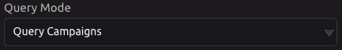

#### ☑ Select Fields to be Returned

* Campaign ID
* Campaign Name
* Campaign Active?
* Campaign Type
* Campaign Status
* Campaign Start Date
* Campaign End Date

These represent the columns of results from a successful query.

#### 📥 Inputs


Query All Campaigns


If selected, the query will not filter its results.


Query All Campaigns


If unselected, there will be options to filter results by any of the following fields.

* ID
  * Click [here](salesforce.md#object-ids) for more information about object IDs.
* Campaign Name
* Active
* Type
* Status

This will return results that match any fields with inputted values.

**Limit** - Optional limit on the number of rows to be returned.

 Click the **Query** button to execute the query.


If you wish to create more customizable queries, try the [custom query mode](salesforce.md#custom-query).


### 💼 Query Cases


#### ☑ Select Fields to be Returned

* Case ID
* Case Subject
* Case Number
* Case Status

These represent the columns of results from a successful query.

#### 📥 Inputs


Query All Cases


If selected, the query will not filter its results.


Query All Cases


If unselected, there will be options to filter results by any of the following fields.

* ID
  * Click [here](salesforce.md#object-ids) for more information about object IDs.
* Case Subject
* Type
* Case Reason
* Status
* Priority

This will return results that match any fields with inputted values.

**Limit** - Optional limit on the number of rows to be returned.

 Click the **Query** button to execute the query.


If you wish to create more customizable queries, try the [custom query mode](salesforce.md#custom-query).


### 👥 Query Contacts

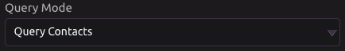

#### ☑ Select Fields to be Returned

* Contact ID
* Contact Name
* Contact Phone Number
* Contact Email

These represent the columns of results from a successful query.

#### 📥 Inputs


Query All Contacts


If selected, the query will not filter its results.


Query All Contacts


If unselected, there will be options to filter results by any of the following fields.

* ID
  * Click [here](salesforce.md#object-ids) for more information about object IDs.
* Contact Name
* Department

This will return results that match any fields with inputted values.

**Limit** - Optional limit on the number of rows to be returned.

 Click the **Query** button to execute the query.


If you wish to create more customizable queries, try the [custom query mode](salesforce.md#custom-query).


### 🗓 Query Events

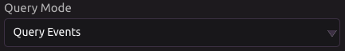

#### ☑ Select Fields to be Returned

* Event ID
* Event Subject
* Event Location
* Event Start Date/Time
* Event End Date/Time

These represent the columns of results from a successful query.

#### 📥 Inputs


Query All Events


If selected, the query will not filter its results.


Query All Events


If unselected, there will be options to filter results by any of the following fields.

* ID
  * Click [here](salesforce.md#object-ids) for more information about object IDs.
* Subject
* Location
* Activity Date
  * Must be of the format YYYY-MM-DD
  * Example: 2020-07-04

This will return results that match any fields with inputted values.

**Limit** - Optional limit on the number of rows to be returned.

 Click the **Query** button to execute the query.


If you wish to create more customizable queries, try the [custom query mode](salesforce.md#custom-query).


### 🕵 Query Leads

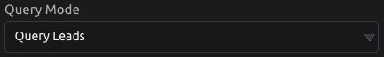

#### ☑ Select Fields to be Returned

* Lead ID
* Lead Name
* Lead Company
* Lead Status
* Lead Phone
* Lead Email

These represent the columns of results from a successful query.

#### 📥 Inputs


Query All Leads


If selected, the query will not filter its results.


Query All Leads


If unselected, there will be options to filter results by any of the following fields.

* ID
  * Click [here](salesforce.md#object-ids) for more information about object IDs.
* Lead Name
* Company
* Lead Status
* Rating

This will return results that match any fields with inputted values.

**Limit** - Optional limit on the number of rows to be returned.

 Click the **Query** button to execute the query.


If you wish to create more customizable queries, try the [custom query mode](salesforce.md#custom-query).


### ✨ Query Opportunities

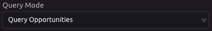

#### ☑ Select Fields to be Returned

* Opportunity ID
* Opportunity Name
* Opportunity Type
* Opportunity Close Date
* Opportunity Stage

These represent the columns of results from a successful query.

#### 📥 Inputs


Query All Opportunities


If selected, the query will not filter its results.


Query All Opportunities


If unselected, there will be options to filter results by any of the following fields.

* ID
  * Click [here](salesforce.md#object-ids) for more information about object IDs.
* Opportunity Name
* Private
* Type
* Lead Source
* Stage

This will return results that match any fields with inputted values.

**Limit** - Optional limit on the number of rows to be returned.

 Click the **Query** button to execute the query.


If you wish to create more customizable queries, try the [custom query mode](salesforce.md#custom-query).


### 📋 Query Tasks

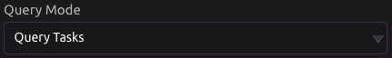

#### ☑ Select Fields to be Returned

* Task ID
* Task Subject
* Task Due Date
* Task Priority
* Task Status

These represent the columns of results from a successful query.

#### 📥 Inputs


Query All Tasks


If selected, the query will not filter its results.


Query All Tasks


If unselected, there will be options to filter results by any of the following fields.

* ID
  * Click [here](salesforce.md#object-ids) for more information about object IDs.
* Subject
* Due Date
  * Must be of the format YYYY-MM-DD
  * Example: 2020-07-04
* Priority
* Status

This will return results that match any fields with inputted values.

**Limit** - Optional limit on the number of rows to be returned.

 Click the **Query** button to execute the query.


If you wish to create more customizable queries, try the [custom query mode](salesforce.md#custom-query).


## ✏ Update Existing Object

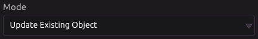

### 👤 Update Account

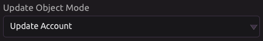

#### Account ID

Enter the ID of the account you want to edit. Click [here](salesforce.md#object-ids) for more information about object IDs.

If the ID is valid, all the fields will be displayed with the current values. Then you can edit any field the same way you would for [creating a new account](salesforce.md#create-new-account).


You must run the program for the changes to be committed.


### 📈 Update Campaign

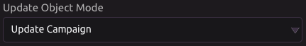

#### Campaign ID

Enter the ID of the campaign you want to edit. Click [here](salesforce.md#object-ids) for more information about object IDs.

If the ID is valid, all the fields will be displayed with the current values. Then you can edit any field the same way you would for [creating a new campaign](salesforce.md#create-new-campaign).


You must run the program for the changes to be committed.


### 💼 Update Case

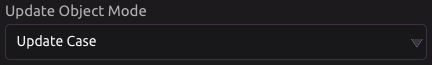

#### Case ID

Enter the ID of the case you want to edit. Click [here](salesforce.md#object-ids) for more information about object IDs.

If the ID is valid, all the fields will be displayed with the current values. Then you can edit any field the same way you would for [creating a new case](salesforce.md#create-new-case).


You must run the program for the changes to be committed.


### 👥 Update Contact

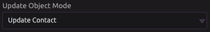

#### Contact ID

Enter the ID of the contact you want to edit. Click [here](salesforce.md#object-ids) for more information about object IDs.

If the ID is valid, all the fields will be displayed with the current values. Then you can edit any field the same way you would for [creating a new contact](salesforce.md#create-new-contact).


You must run the program for the changes to be committed.


### 🕵♀ Update Lead


#### Lead ID

Enter the ID of the lead you want to edit. Click [here](salesforce.md#object-ids) for more information about object IDs.

If the ID is valid, all the fields will be displayed with the current values. Then you can edit any field the same way you would for [creating a new lead](salesforce.md#create-new-lead).


You must run the program for the changes to be committed.


### ✨ Update Opportunity

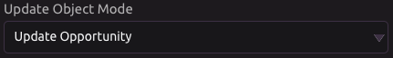

#### Opportunity ID

Enter the ID of the opportunity you want to edit. Click [here](salesforce.md#object-ids) for more information about object IDs.

If the ID is valid, all the fields will be displayed with the current values. Then you can edit any field the same way you would for [creating a new opportunity](salesforce.md#create-new-opportunity).


You must run the program for the changes to be committed.


