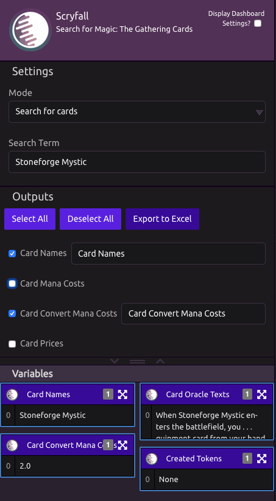

# Scryfall

## 🔎 Search for cards

### ⚙ Settings

* **Search Term** - Name of magic card

### 📤 Outputs

* **Card Names**
* **Card Mana Costs**
* **Card Convert Mana Costs**
* **Card Prices**
* **Card Oracle Texts**
* **Created Tokens**
* **Created Token IDs**

## Get Data About All MTG Sets

### 📤Outputs

* **Set Names**
* **Set Codes**
* **Card Counts**
* **Release Dates**

