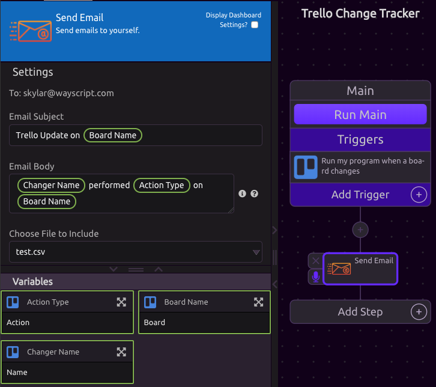

# Send Email

The Send Email module allows you to send emails to the address associated with your account.

## Include Variables

Variables can be Included in the Subject and Body of your email.

## Attach File

You can select any file on your account to include as an attachment.

