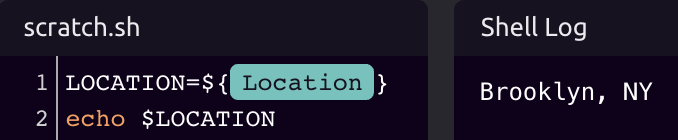
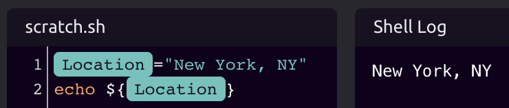
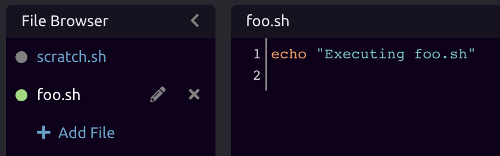
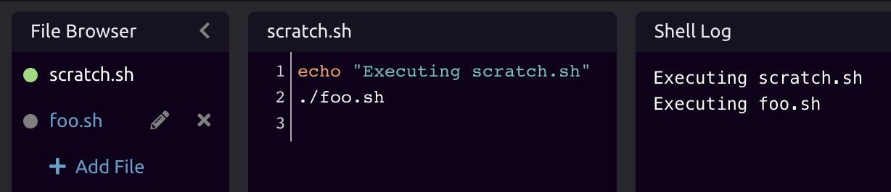

# Shell Script



See [Code Editors](../../getting_started/code-editors.md) for more information on composing code in WayScript.


## Working with Variables <a id="working-with-variables"></a>

###  📥 Inputs <a id="inputs"></a>

WayScript's shell script editor lets you reference [Variables](https://docs.wayscript.com/getting_started/variables) that exist in your program. To do this, you can reference them through the **variables** [**associative array**](https://www.gnu.org/software/bash/manual/html_node/Arrays.html).

As an example, let's create a variable called "Location" and set a value of "Brooklyn, NY"


You can then reference the Location variable in your shell script:

```bash
LOCATION=${variables["Location"]}
```

More abstractly, you reference any variable with the format:

```bash
MY_VAR=${variables[ "<var_name>" ]}
```



### ​ 📤 Outputs <a id="outputs"></a>

#### ​  Return Data from Your Shell Script <a id="return-data-from-your-javascript"></a>

You can also output data from your shell script and turn these into variables that can be used by other [Modules](https://docs.wayscript.com/getting_started/modules) in your program.

You can do this with the **variables associative array** in the following format:

```bash
variables["<Var Name>"]=value
```



## ▶ Running a Shell Script <a id="running-javascript"></a>

While working on your script, you can press the "Run Code" button inside the module to run the script and see updated results.

## ↘ Calling Other Scripts

You can add and reference other shell scripts in your File Browser. For example, suppose you have a file called `foo.sh`.



You can run `foo.sh` from `scratch.sh`:

```bash
./foo.sh
```



