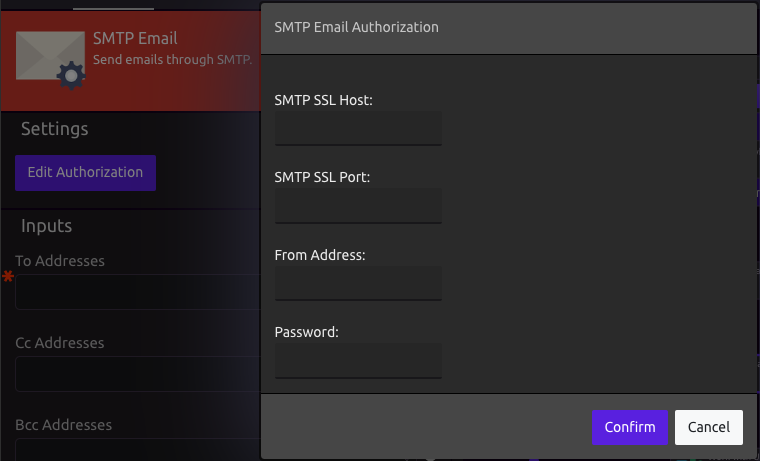
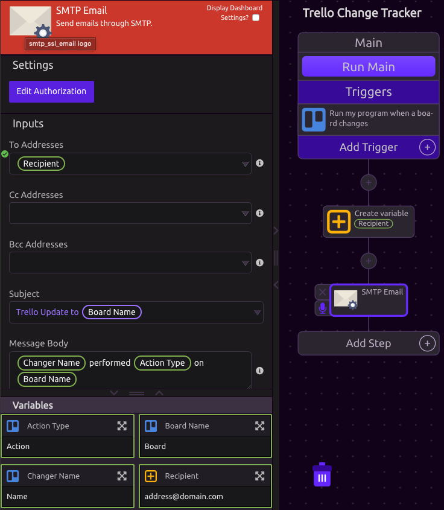

# SMTP Email

## 🔗 Link Your Email

When you drag in a SMTP module for the first time, follow the prompt to authorize access.


You can edit your authorization from the module settings.


##  Include Variables

Variables can be Included in any of the fields.

