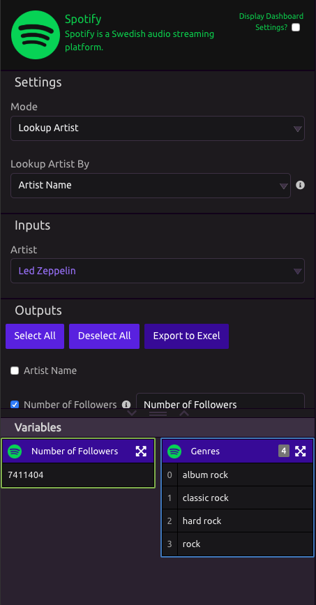

# Spotify

## Settings

* **Mode**
  * **Options -** Lookup Artist
* **Lookup Artist By**
  * **Options -** Artist Name, Spotify ID, Spotify URI
  * **Warning -** Looking up artist by 'Artist Name' will return top search result, correct result is not guaranteed. For full results, use the JSON Output

## Inputs

* **Artist** - Put in the artist input that fits your **Lookup Artist By** selection

## Outputs

* **Artist Name**
* **Number of Followers** - Number of listeners following the artist
* **Genres** - A list of the genres the artist is associated with. For example: 'Prog Rock, Post-Grunge'
* **ImageURL** - Image URL of the artist \(height 640px\)
* **Popularity** - The popularity of the artist. The value will be between 0 and 100, with 100 being the most popular. The artist’s popularity is calculated from the popularity of all the artist’s tracks.
* **Spotify ID** - The Spotify ID for the artist
* **Spotify URI** - The Spotify URI for the artist.
* **JSON Data** - Raw JSON data received from the API

