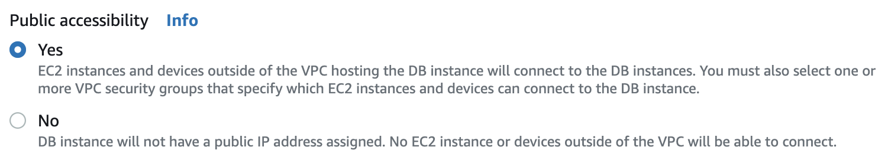
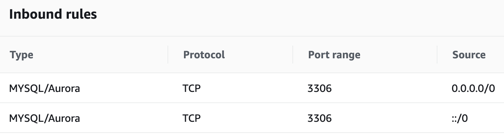
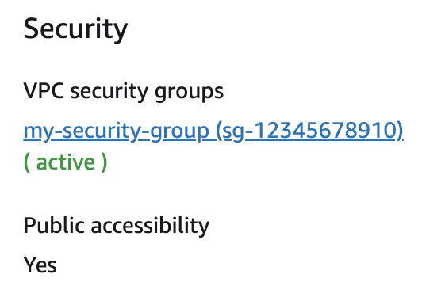
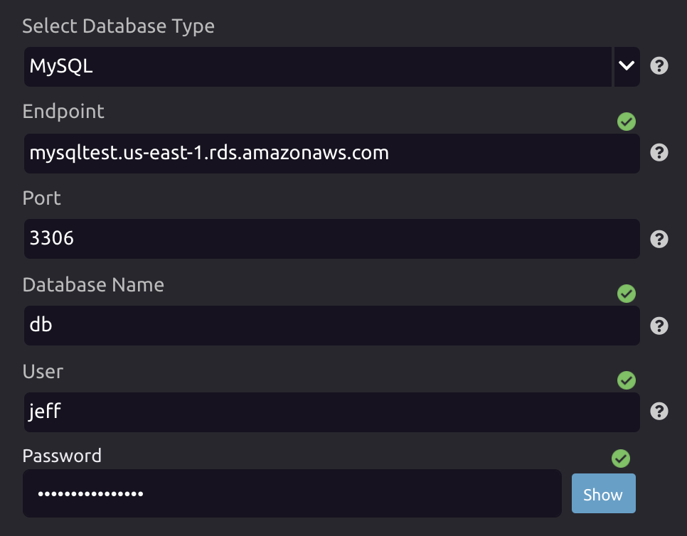
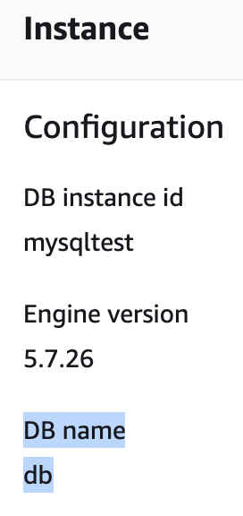
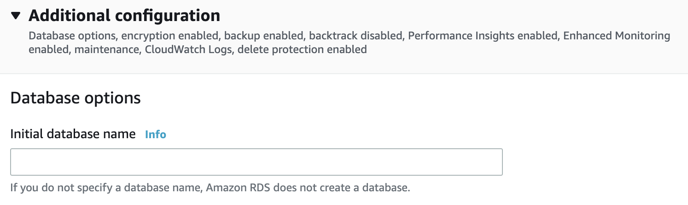
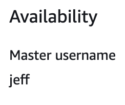
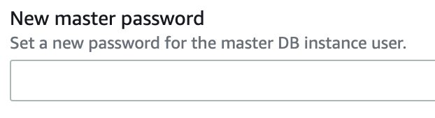

# Connecting to AWS RDS

## Configuring Your Database

### Enable Public Accessibility

To connect to your database using WayScript, your database must be publicly accessible. Enable "Public accessibility"  in the settings for your database.

### Update your Security Group Settings

You will also need to update the settings for the security group associated with your DB instance. Configure the "Inbound rules" for the security group to allow all public connections to the port your database communicates on, or whitelist the specific IP addresses used by WayScript.

💡 You can find the current list of WayScript's IP Addresses in the page below:



💡 You can find the security group associated with your DB instance by checking the "Connectivity & Security" tab for your database instance in the AWS console.

### Additional References

* [How can I troubleshoot connectivity to an Amazon RDS instance that uses a public or private subnet of a VPC?](https://aws.amazon.com/premiumsupport/knowledge-center/rds-connectivity-instance-subnet-vpc/)
* [A DB Instance in a VPC Accessed by a Client Application Through the Internet](https://docs.aws.amazon.com/AmazonRDS/latest/UserGuide/USER_VPC.Scenarios.html#USER_VPC.Scenario4)

## Obtaining Connection Information

To connect to your database using WayScript, you will need the following information:

### Endpoint & Port

The Endpoint and Port information is available in the "Connectivity & Security" tab for the database instance in the AWS console.

### Database Name

The Database Name is available in the "Configuration" tab for the database instance in the AWS console.


DB name is _**NOT**_ the same as DB instance id


💡 If your "DB name" field is blank, this is probably because you did not specify a database name when creating the database instance, under "Additional configuration."

### Master Username \(User\)

The Master Username is available in the "Configuration" tab for the database instance in the AWS console, under the "Availability" section.

### Master Password \(Password\)

The Master Password was set when you created your DB instance. If you forgot this password, you can "Modify" your database instance and change the password.

