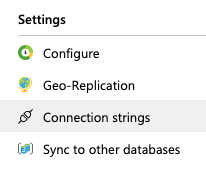
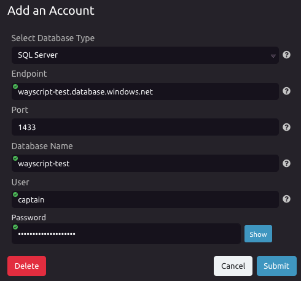
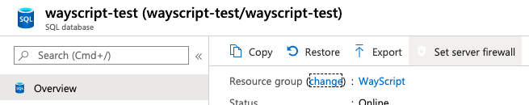
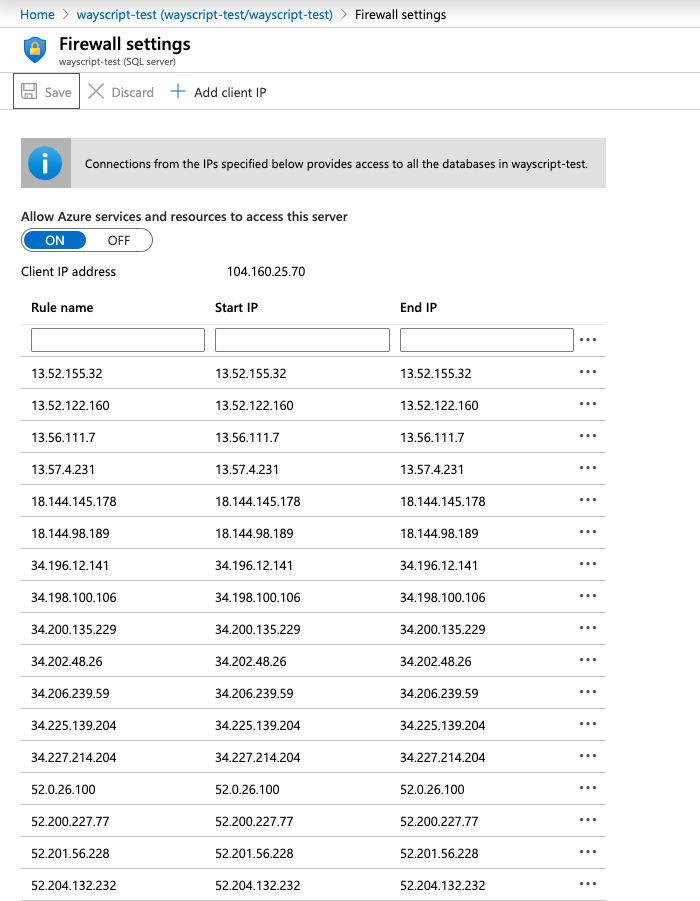

# Connecting to SQL Azure

## Obtain the Connection String for your Database

1. Login to the Microsoft Azure Portal and navigate to the database you would like to connect
2. Under "Settings" click on "Connection Strings"    
3. Click "ODBC" to view the connection string details, taking note of the Server URL \(e.g. wayscript-test.database.windows.net\), Port \(e.g. 1433\), Database \(e.g. wayscript-test\), and Uid \(e.g. captain\)


You will also need to know the password for your database user.


## Enter the Connection Information in WayScript

1. In the SQL Module Account Selector, click "Add an Account"
2. Enter the information gathered from the connection string above, including the password for your database user
3. Click "Submit" to create the new account


Make sure _all_ connection info matches, including the port!


## Add WayScript's IP Addresses as Exceptions to the Database's Firewall

1. In the SQL Azure Portal, navigate to the "Overview" page for your database, then click on "Set server firewall"

    2. Add all of the IP Addresses described in the page below to your database firewall settings



