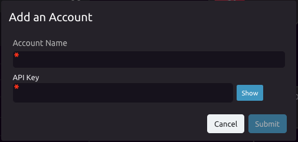

# Stripe


## ➕ Add Your Stripe Account

Under "Select an API Key," select "Add an Account..."



[Click here](https://stripe.com/docs/keys) for information on Strip API Keys.

## ⚙ Modes

### ⚖ View Account Balance

Outputs available account balances.

```graphql
Account_Balance = {
    available : [
        {
            amount : Float,
            currency : String
        }
    ],
    connect_reserved : [
    ],
    livemode : Bool,
    object : String,
    pending : [
        {
            amount : Float,
            currency : String
        }
    ]
}
```

### 🔢 View SKUs

Outputs product SKUs.

```graphql
Account_SKUs = {
    data : [
        {
            id : String,
            object : String,
            active : Bool,
            attribute_size : String,
            attribute_gender : String,
            created : Int,
            currency : String,
            inventory_quantity : Float,
            inventory_type : String,
            inventory_value : String,
            livemode : Bool,
            package_dimensions : String,
            price : Float,
            product : String,
            updated : String
        }
    ]
}
```

### 💵 View Charges

Outputs a list of charges.

```graphql
Account_Charges = {
    data : [
        {
            id : String,
            object : String,
            amount : Float,
            amount_refunded : Float,
            application : String,
            application_fee : String,
            application_fee_amount : Float,
            balance_transaction : String,
            captured : Bool,
            created : Int,
            currency : String,
            customer : String,
            description : String,
            disputed : Bool,
            failure_code : String,
            failure_message : String,
            invoice : String,
            livemode : Bool,
            paid : Bool,
            payment_intent : String
        }
    ]
}
```

