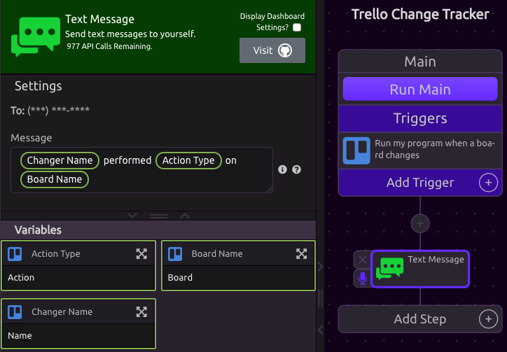

# Text Message


Check out Twilio on [GitHub](https://github.com/twilio/twilio-python).



To run your program with a text message, use the [Text Message Trigger](../triggers/text-message-trigger.md).


## About

The Text Message module allows you to send text messages to yourself. This can be especially useful in combination with the [Text Message Trigger](../triggers/text-message-trigger.md) if you want to send a message to WayScript and then have WayScript reply with a result.


Messages come from **\(415\) WYS-CRPT** \(+1 415 997 2778\).


## 📱Phone Number Verification


If you haven't yet verified your phone number with your WayScript account, you will need to do so before using this module. See [Phone Number Verification](../../account-management/phone-number-verification.md) for details.


## ✏Composing a Message

You can use a combination of free text and variables to compose your message.

