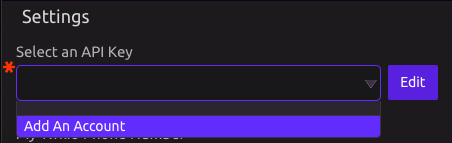
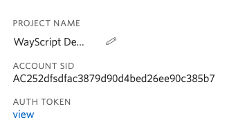
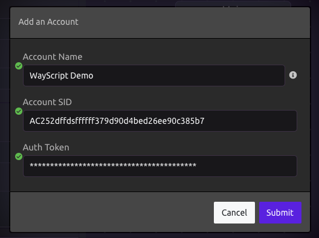

# Twilio


This module requires that you have a Twilio SMS account. If you don't please set one up before continuing. 



If you would like to send text messages to yourself, check out the Text Message module.


## Setting up your Account

### 1\) Add New Account

Click 'Add New Account' in your Twilio Module Settings.

### 2\) Go to your [Twilio Dashboard](https://www.twilio.com/console)

### 3\) Input API Key Data

From your Twilio Dashboard, grab your Account Name, Account SID, and Auth Token. 

Copy and paste the data into the WayScript modal.

Press submit.

## Settings

* **Twilio Phone Number** - Input your Twilio SMS phone number. 
  * Required Format: +12223334567

## Inputs

* **Phone Number** - This is the phone number you are sending a message to.
  * Required Format: +12223334567
* **Text Message** - This is your message.You can [include variable values](../../introduction/modules.md#option-two-hardcode-a-value) in your messages.

