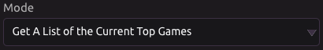
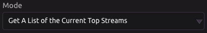
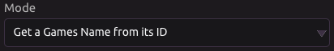
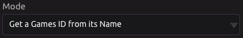

# Twitch

## 🎮 Get a List of the Current Top Games

### 📥 Inputs

* Number of Games
  * Default is 20.
  * Maximum is 100.

### 📤 Outputs

* List of Top Games by name
* List of Top Games by ID
* JSON Data


A Games ID can be found in the Games by ID list at the same index that it's in this list.


## 📺 Get a List of the Current Top Streams

### 📥 Inputs

* Number of Streams
  * Default is 20.
  * Maximum is 100.
* Filter by Game ids
  * Optional
  * Maximum 100
* Filter by User Names
  * Optional
  * Maximum 100
* Filter by Languages
  * Optional
  * Maximum 100

### 📤 Outputs

* List of Top Streamers
* List of Top Streamers Viewer Counts
* JSON Data


To match streamer names to viewer counts, look at the same index in each corresponding list.


## 🕹 Get a Game's Name from Its ID

### 📥 Inputs

* Game ID \(Required\)

### 📤 Outputs

* Game Name
* JSON Data

## 🤖 Get a Game's ID from Its Name

### 📥 Inputs

* Game Name \(Required\)

### 📤 Outputs

* Game ID
* JSON Data

