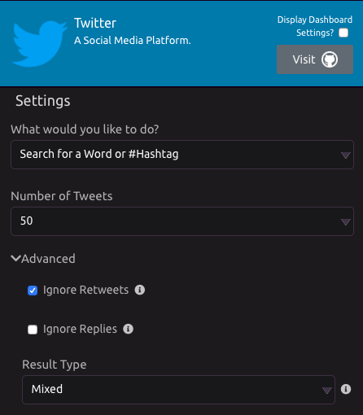
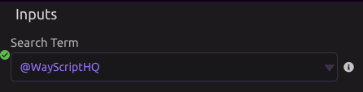
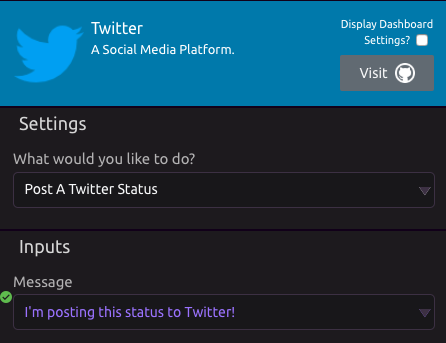

# Twitter


Check out twython on [GitHub](https://github.com/ryanmcgrath/twython).


## 🔎 Search for a Word or \#⃣Hashtag

### ⚙ Settings

* **Number of Tweets** - Enter the number of tweets you want to receive.

#### 💡 Advanced

* **Ignore Retweets** - Ignore retweets of posts. Will only return original tweets.
* **Ignore Replies** - Ignore replies to posts. Will only return original tweets.
* **Result Type** - Specifies what type of search results you would prefer to receive. The default value is "Mixed".
  * Options: Recent, Popular, Mixed

### 📥 Inputs

* **Search Term** - Excepts Keywords, \#hashtags, or @usernames.
  * Max length: 500 characters.

### 📤 Outputs

* **Tweets**
* **Usernames**
* **Persons Names**
* **Number of Post Retweets**
* **Number of Followers**
* **Date and Time**
* **Tweet URLs**

## 🐦 Tweet History of a User

### 📥 Inputs

* **Include Retweets** - Select whether you want to include retweets or not. 
  * Options: Yes, No
* **Username** - Enter the name of the User whose tweet history you want. 
  * Note: @ not required in username

### 📤 Outputs

* **Tweets**
* **Persons Names**
* **Number of Post Retweets**
* **Number of Times Favorites**
* **Date/Time of Posts**
* **Other Usernames Mentioned in Post -** a [List](../../getting_started/variables.md#lists) of lists all usernames in the tweet. 
* **URLs Mentioned in Tweet** - a [List](../../getting_started/variables.md#lists) of lists all urls in the tweet. 
* **Hashtags** - a [List](../../getting_started/variables.md#lists) of lists all hashtags in the tweet. 

## 👥 Get Data on a User by Username

### 📥Inputs

* **Username** - Enter the name of the User whose tweet history you want. 
  * Note: @ not required in username

### 📤 Outputs

* **Profile Description**
* **User Website**
* **Number of Followers**
* **Number Following**
* **Number of Tweets**
* **Number of Likes**
* **User Location**
* **Name**
* **Profile Image URL**
* **Is Verified**
* **Account Created Date**

## 💬 Post a Twitter Status

### 📥 Inputs

* **Message** - Enter in the message field what you want your status to be.

## ⌛ My Profile Timeline

This mode pulls data from your own timeline.

### 📤 Outputs

* **Tweets**
* **Number of Post Retweets**

