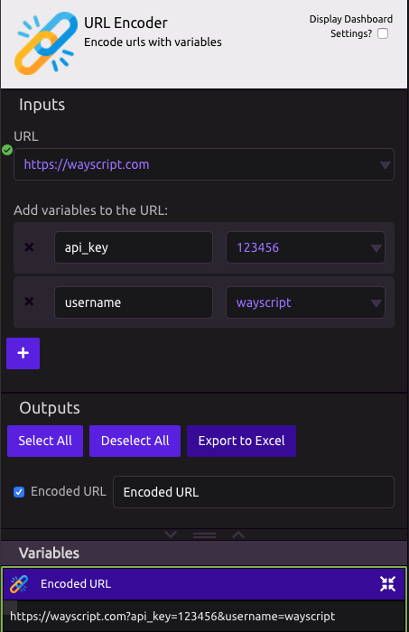

# URL Encoder

## 📥 Inputs

* **URL** - The base url you want to use. 
  * Example - [https://wayscript.com](https://wayscript.com)
* **Add variables to the URL**

## 📤 Outputs

* **Encoded URL** - The result is your encoded url

