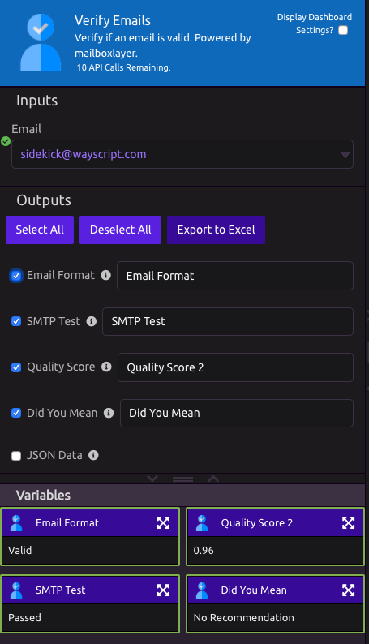

# Verify Emails


Powered by [mailboxlayer](https://mailboxlayer.com/).


## 📥 Inputs

* **Email** - Email address you want to verify

## 📤 Outputs

* **Email Format** - Returns 'Valid' for proper email syntax, otherwise returns 'Invalid'.
* **SMTP Test** - Contacts the email address via the Simple Mail Tansfer Protocol \(SMTP\) to determine whether the email address provided actually exists. Returns 'Passed' if the email address exists, otherwise returns 'Failed'
* **Quality Score** - Returns a value from 0 \(Bad\) to 1 \(Good\)  \(Quality Score is only an indicator and should not be the only factor when determining whether or not to send to an email address.\)
  * For transactional email: 
    * \(1.00-0.65: Good\) 
    * \(0.64-0.33: Medium\)
    * \(0.32-0.00: Bad\)
  * For marketing email:
    * \(1.00-0.80: Good\) 
    * \(0.79-0.49: Medium\)
    * \(0.48-0.00: Bad\)
* **Did You Mean** - Returns an alternative email suggestion if a potential misspelling is detected in the domain part of the email address
* **JSON Data** - Raw JSON data received from the API

