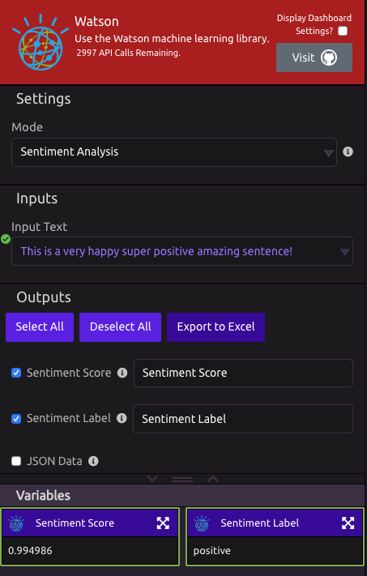

# Watson


View on [Github](https://github.com/watson-developer-cloud/python-sdk).


## Sentiment Analysis

**Aggregate Sentiment Analysis** - Can accept [lists](../../getting_started/variables.md#lists) and gives back an average sentiment score.  
**Sentiment Analysis** - Gives a sentiment of a [single inpu](../../getting_started/variables.md)t.

### Inputs

* **Input Text** - The text \(or list of texts\) you want to perform sentiment analysis on.

### Outputs

* **Sentiment Score** - Returns a number between -1 to 1. -1 is very bad, 0 is neutral, 1 is very good.
* **Sentiment Label** - Returns Positive, Negative, or Neutral.
* **JSON Data** - Raw JSON data received from the API.

## Extract Keywords

## Settings

* **Minimum Relevance -**Select the minimum relevance words have to have to the text to be considered a keyword. The higher the minimum relevance, the more relevant a word has to be in order to be considered a keyword.

## Inputs

* **Input Text -** The text you want to perform sentiment analysis on.

## Outputs

* **Watson Keywords** - A list of keywords from the Input Text.
* **JSON Data** - Raw JSON data received from the API.

