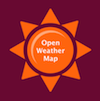

# Weather API


You can read a tutorial using this Module [here](../../getting_started/modules.md).



To run your program at sunrise and/or sunset in a given location, use the [Weather API Trigger](../triggers/weather-api-trigger.md).


## Settings

* **Temperature Type**: Fahrenheit, Celcius, Kelvin

## Inputs

* **Location** - Input a location to search \(e.g. Brooklyn NY, 123 Fifth Street, etc.\) 
  * This is a required input.

## Outputs

* **City Name -** Name of the City \(ex: Palo Alto\)
* **Weather Condition Category -** Categories: Thunderstorm, Drizzle, Rain, Snow, Clear, Clouds, Atmosphere \( implies mist, haze, fog or other visual impairments \)
* **Weather Condition Summary** - Clear, Light, or Heavy
* **Weather Conditions** - A more detailed [list](../../getting_started/variables.md#lists) of weather conditions.[ More info here.](https://openweathermap.org/weather-conditions)
* **Weather Condition IDS -** IDS for more detailed weather conditions.[ More info here.](https://openweathermap.org/weather-conditions)
* **Sunrise Time -** Time of sunrise 
* **Sunset Time -** Time of sunset
* **Current Temperature** - Current temperature of **Location**
* **Minimum Temperature -** Minimum temperature for the day
* **Maximum Temperature** - Maximum temperature for the day 
* **Humidity -** Returned as a Percent \(ex: 50%\)
* **Pressure** - hPa
* **Visibility -** Visibility, meters
* **Wind Speed -** Wind speed, mps
* **Wind Direction -** Wind direction, degrees \(meteorological\)
* **JSON Data -** Raw JSON data received from the API

