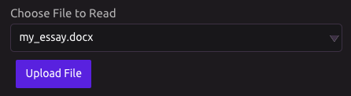
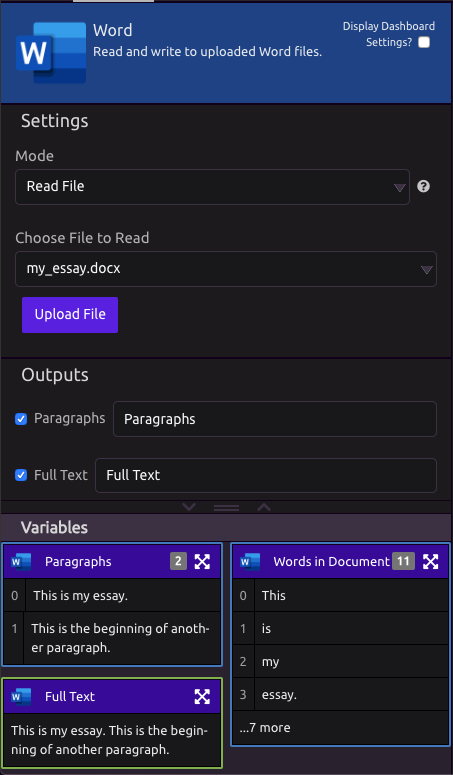
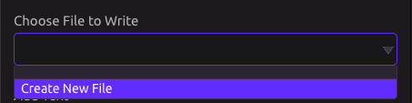
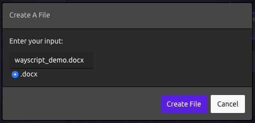
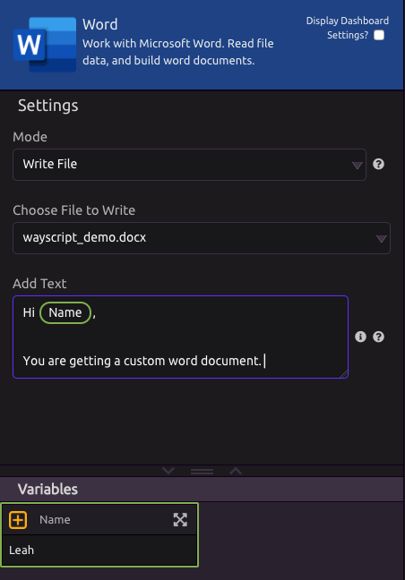
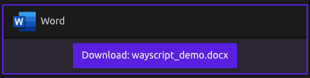

# Word

## Read File

### Choose File To Read

You can upload a Word document to WayScript or select a document you have already uploaded. 

### Outputs

* **Paragraphs -** A [list](../../getting_started/variables.md#lists) where each item is the contents of a paragraph. 
* **Full Text -** A [single item](../../getting_started/variables.md#single-item) containing all of the text from the document. 
* **Words in Document** - A [list](../../getting_started/variables.md#lists) where each item is a unique word from the document. 

## Write File

### Create a File

Under Settings &gt; Choose File to Write, select 'Create New File'

In the modal, create a name for your file. 

### Add Contents

You can include variables in your text document.

### Download Document

When your program runs, you can download your Word document directly from the log. 


You can manage and download files anytime from your [file manager](https://wayscript.com/file_manager). 


