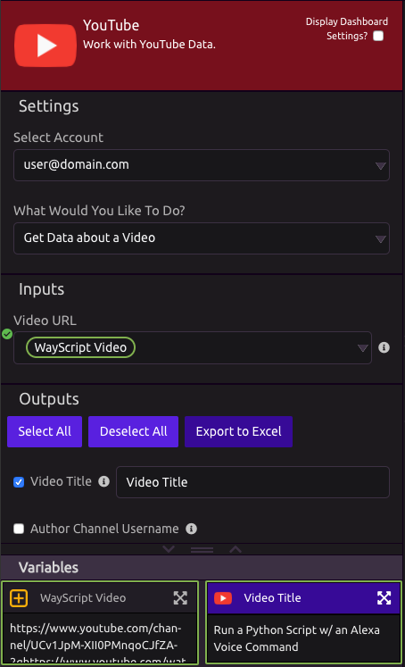

# YouTube

## Link Your YouTube Account

When using a YouTube module for the first time, follow the prompt to authorize access.


You can add additional accounts from the YouTube module settings.


## Search for Videos by Keyword

### Inputs

* Search Term
* Maximum Number of Results
* Advanced:
  * Sort Order
  * Filter Results by U.S. Zip Code

### Outputs

* Video Title
* Author Channel Username
* Video URL
* Video Description
* Date Published
* Author Channel ID
* Video ID

## Get Data About a Video

### Inputs

* Video URL

### Outputs

* Video Title
* Author Channel Username
* Video Description
* Date Published
* Author Channel ID
* Video Tags
* View Count
* Comment Count
* Like Count
* Dislike Count
* Favorited Count

## Get Comments on a Video

### Inputs

* Video URL
* Maximum Number of Comments
* Advanced: Sort Order
  * Time
  * Relevance

### Outputs

* Comment Text
* Author Channel Username
* Date Published
* Author Channel ID
* Author Channel URL
* Like Count
* Reply Count

## Get Data on a Channel \(User Account\)

### Inputs

* Account/Channel Username

### Outputs

* Video Description
* View Count
* Comment Count
* Subscriber Count
* Number of Videos Uploaded
* Channel URL

