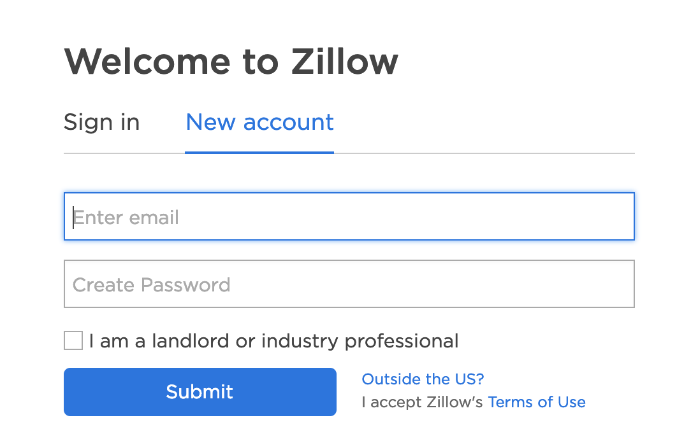
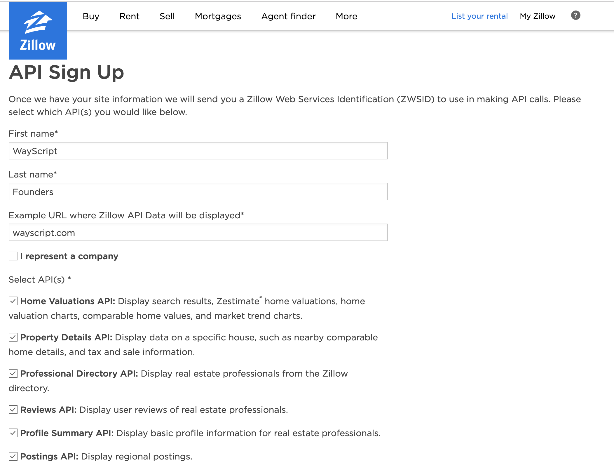

# Zillow



Check out python-zillow on [GitHub](https://github.com/seme0021/python-zillow).


## 🔑 Registering for an API Key


The Zillow module requires you to create an API Key on Zillow.


### 1\) Go to [Zillow API Signup Dashboard](https://www.zillow.com/user/Register.htm)

### 2\) Click the 'New Account' tab and submit the required information. 



### 3\) Fill out the API Sign Up


CHECK ALL APIs under the select API\(s\) section!




### 4\) You will recieve your Zillow Identification Key \(ZWSID\) via email. 

## 📥 Inputs

* **Address** - Format: Street, Town, State
  * Ex: 3400 Pacific Ave., Marina Del Rey, CA
* **Zip Code** - United States Zip \(postal\) Code
  * Ex: 90292

## 📤 Outputs


Outputs are [single Items](../../getting_started/variables.md#single-item) if mode is "Get Data on an Address." Outputs are [lists](../../getting_started/variables.md#lists) if mode is "Get Comparables to an Address."


```graphql
Property = {
    value : Number, 
    amount_change_30days : Number, 
    amount_last_updated : Date, 
    valuation_range_high : Number, 
    valuation_range_low : Number,
    num_bathrooms : Float, 
    num_bedrooms : Number, 
    finished_sqft : Number, 
    last_sold_date : Date, 
    last_sold_price : Number, 
    lot_size_sqft : Number, 
    tax_assessment : Number, 
    tax_assessment_year : Date, 
    year_built : Date, 
    usecode : String, 
    complete : Bool,
    currency : String, 
    zpid : String, 
    links : {
        comparables : Url,
        graphs_and_data : Url,
        home_details : Url,
        map_this_home : Url,
    },
    full_address : {
        city : String, 
        latitude : String, 
        longitude : String, 
        state : String, 
        street : String, 
        zipcode : String,
    },
}
```

