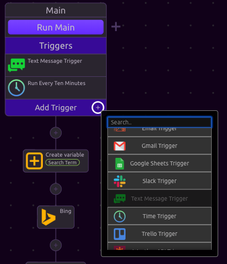
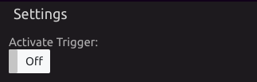
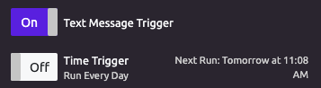

# Triggers

## ➕ Adding a Trigger

### ❗ Trigger Restrictions

#### Unlimited

These Triggers can be added to any function, as many times as desired. 

* [Time Trigger](time-trigger.md)

#### One per function

These Triggers can be added only once to each function.

* [Webhook Trigger](webhook-trigger.md)
* [Discord Trigger](discord-trigger.md)
* [Gmail Trigger](gmail-trigger.md)
* [Google Sheets Trigger](google-sheets-trigger.md)
* [Salesforce Trigger](salesforce-trigger.md)
* [Slack Trigger](slack-trigger.md)
* [Trello Trigger](trello-trigger.md)
* [Weather API Trigger](weather-api-trigger.md)

#### One per Program

These Triggers can be added only once to a single function.

* [Alexa Trigger](alexa-trigger.md)
* [Email Trigger](email-trigger.md)
* [Text Message Trigger](text-message-trigger.md)

## ⚡ Activating Triggers

When a new Trigger is added, it must be activated by the user. This can be done in two ways:

Trigger Settings

On the Dashboard, all triggers appear in the footer of the program tile.

