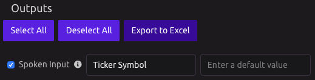

# Alexa Trigger

## Setup

### Enable Alexa

Add the WayScript skill to your Amazon Alexa account. [Get the WayScript Alexa Skill.](https://www.amazon.com/gp/product/B07QXXG32B)


WayScript will remind you to do this the first time you use an Alexa Trigger.


### Program Alias

You can supply an easy-to-understand alias for your program.


Useful when your program name is long or difficult for Alexa to understand


## Voice Commands

### Pass in Spoken Input

To pass the input in your voice command, add "with \[Variable Value\]" to your Alexa phrase.

You can pass an argument to your Alexa-Triggered program by enabling the "Spoken Input" variable in the Outputs panel.

Suppose your program is called 'Stock Prices' and takes a single input called \[Ticker Symbol\] as input, you could then speak the following phrase to Alexa:

> "Alexa, launch WayScript and run 'Stock Prices' with AAPL."

### Speak a Phrase

Once you have added the Alexa Trigger to a program, you can include the Alexa module, which will allow Alexa to speak to you while your program is running.

You can reference variables that were created earlier in the program and insert them into an Alexa Phrase. See the [Alexa module documentation](../modules/alexa.md) for more details.

## Tutorial

For a brief tutorial on how to use the Alexa Trigger, see [Run a Python Script with an Alexa Voice Command.](https://wayscript.com/blog_entry/36)

## FAQs

Q. When I say "Alexa, launch WayScript and run 'Hello World'", Alexa replies "You have WayScript enabled, Do you want to open it?" No matter what I say next, nothing happens. 

* When you get the "You have WayScript enabled, Do you want to open it?" response, Alexa was able to understand "WayScript," but could not understand the rest of the command. 
* In order to help Alexa better understand the command, you may need to enunciate it more clearly or slowly. Getting closer to the Echo device can help, as can doing Voice Training by saying "Alexa, learn my voice."

