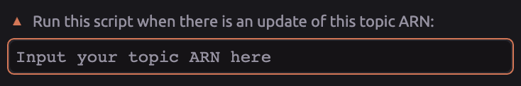
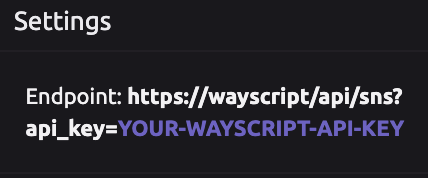

# Amazon SNS Trigger


## ⚙ **Setup**

### 📥 Input your SNS Topic ARN



**You will need to sign in to your amazon SNS console and copy the ARN string to the input box**

For more information on how to configure Amazon SNS, refer to the link below:

[https://docs.aws.amazon.com/sns/latest/dg/sns-configuring.html](https://docs.aws.amazon.com/sns/latest/dg/sns-configuring.html)

### 📌 **Subscribe to the ARN topic with the provided endpoint**



* \*\*\*\*[**Get your WayScript API key**](../../account-management/managing-your-api-key.md)\*\*\*\*

         Your WayScript API key can be found by clicking the settings icon on the left navigation bar.


* **Copy your endpoint to a new Amazon SNS subscription**


## 📤**Output**

```graphql
Topic_Notification = { messageID: String,
                       message: String,
                       subject: String,
                       topicArn: String,
                       timestamp: String,
                       signatureVersion: String,
                       signature: String
                       signingCertURL: String,
                       unsubscribeURL: String, }
```

