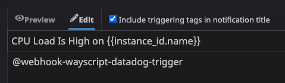

# Datadog Trigger



To get details about your Datadog monitors, use the [Datadog Module.](../modules/datadog.md)


## ⚙ **Setup**

### 🗝 Input or Select an API Key

**You will need to have access to two keys in order to return data from the Datadog API:**

* **Application Key** - Gives access to interacting with the Datadog Agent.
* **API Key** - Unique to your organization

Both of these keys can be found [here](https://app.datadoghq.com/account/settings#api).

### 👥 Choose your Organization

Select the organization you'd like to use the trigger with.

### 📧 Mention @webhook-wayscript-datadog-trigger

In order for your webhook event to be sent to WayScript, you'll need to mention @webhook-wayscript-datadog-trigger in the alert or event in order for it to be sent to your trigger.



## \*\*\*\*📤 **Output**

```graphql
Event = {
    "body": String,
    "id": Number,
    "last_updated": Number,
    "event_type": String,
    "title": String,
    "date": Number,
    "url": URL,
    "snapshot_url": URL,
    "tags": [ String ],
    "hostname": String,
    "logs_sample": String,
    "org":{
        "id": Number,
        "name": String 
        },
    "alert":{
        "id": Number,
        "metric": String,
        "priority": String,
        "query": String,
        "scope": String,
        "status": String,
        "title": String 
        },
    "user":{
        "name": String,
        "username": String,
        "email": String }
    }
```

