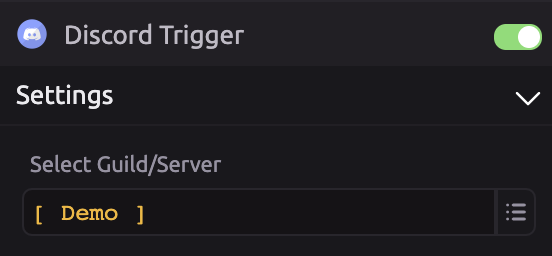
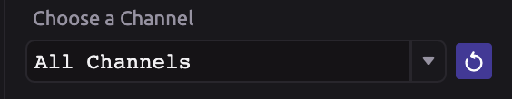
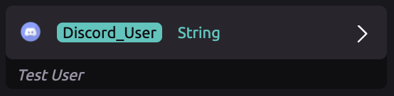

# Discord Trigger


To interact with discord channels using the WayScript bot, use the [Discord module](../modules/discord.md).


## 🔗 Link Your Discord Account

⚡ You can trigger WayScript programs to run when various Discord events occur.

In order to do this, you must first link your Discord account. Then, select the Discord Guild/Server you want to work with.

## ⚙ Settings

### ⚡ Choose when to run the program

Run program when:

* A message was posted to the channel
* A user joined the server

### \#⃣ Choose a Channel

Choose a Discord channel to work with.


If you have recently added a channel and do not see it, click the refresh button.


## 📤 Outputs

The Discord User output will always be available.

If your trigger is set to run when "a message was posted to a channel," the Discord Message Text output will also be available.

